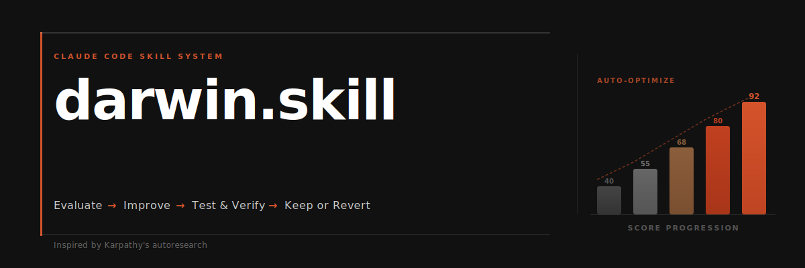
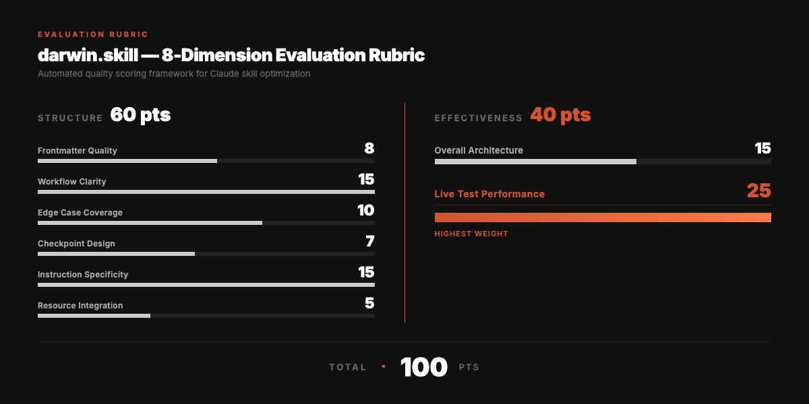
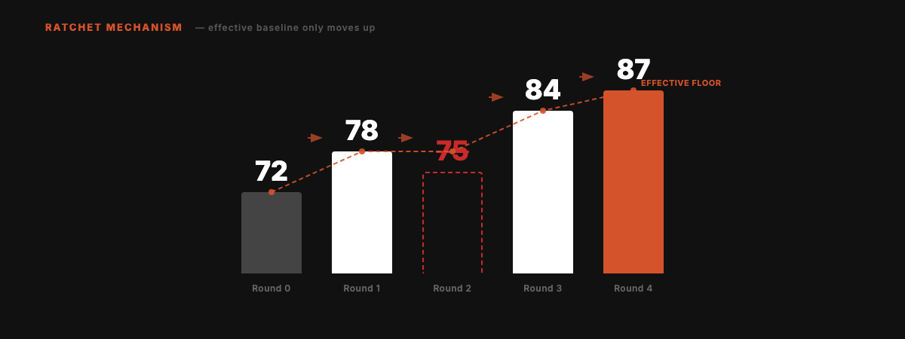

<div align="right">

English | **[中文](README.md)**

</div>



<div align="center">

# darwin.skill

**Optimize your Agent Skills the way you train models.**

Inspired by [Karpathy's autoresearch](https://github.com/karpathy/autoresearch). Autonomous experiment loops, applied to skill optimization. A ratchet that only turns forward.

[](LICENSE)
[](https://skills.sh)
[](https://skills.sh)

```
npx skills add alchaincyf/darwin-skill
```

</div>

---

## The Core Loop


Evaluate → Improve → Test → Human Confirm → Keep or Revert. Repeat.

---

## Why This Exists

Agent skill ecosystems are expanding fast. Claude Code, Codex, OpenClaw, Trae, CodeBuddy and more all support the SKILL.md format. When you have 10 skills, you can maintain them by hand. When you have 60+, you need a system.

Traditional skill review is purely structural: does the frontmatter look right? Are the steps numbered? Do the file paths exist? But a perfectly formatted skill can still produce terrible output.

darwin.skill evaluates both **structure** and **real-world effectiveness**, then keeps only the changes that actually improve things.

---

## From autoresearch to Skill Optimization

This project maps Karpathy's autoresearch directly onto skill optimization:

| autoresearch | darwin.skill | Why |
|:---|:---|:---|
| `program.md` | This SKILL.md | Defines evaluation criteria and constraints |
| `train.py` | Each target SKILL.md | The single editable asset per experiment |
| `val_bpb` | 8-dimension weighted score (max 100) | Quantifiable optimization target |
| `git ratchet` | keep / revert mechanism | Only improving commits survive |
| `test set` | test-prompts.json | Validates whether improvements are real |
| Fully autonomous | **Human in the loop** | Skill quality is more subjective than loss |

The key difference: autoresearch is fully autonomous (loss is just a number). Skill quality sometimes needs human judgment. So darwin.skill pauses after each skill's optimization cycle, shows you the diff and score delta, and waits for your confirmation.

---

## Five Core Principles

| # | Principle | Details |
|:---|:---|:---|
| 01 | **Single editable asset** | One SKILL.md per experiment. One change, one measurement, one decision |
| 02 | **Dual evaluation** | Structure scoring (static analysis) + effectiveness scoring (live test execution) |
| 03 | **Ratchet mechanism** | Score can only go up. Regressions are auto-reverted |
| 04 | **Independent scoring** | The agent that edits is never the agent that scores |
| 05 | **Human in the loop** | System pauses after each skill. You review, then continue |

---

## 8-Dimension Evaluation Rubric

Total: 100 points. Structure (60) + Effectiveness (40).



> Live test performance has the highest weight (25 points). A beautifully written skill that produces bad output is still a bad skill.

---

## The Optimization Cycle

Five phases. Only one is the core.


**Phase 2 (the heart):**

1. Find the lowest-scoring dimension
2. Generate one targeted improvement
3. Edit SKILL.md, git commit
4. Independent sub-agent re-scores
5. Score up → keep. Score down → git revert
6. Pause. Show diff + score delta. Wait for human confirmation

---

## The Ratchet

Scores can only go up. Failed experiments are cleanly reverted. No regressions accumulate over time.



Round 2 scored 75, below the current best of 78. Auto-reverted. Effective baseline stays at 78. Subsequent improvements build from 78, not 75.

---

## Quick Start

```bash
npx skills add alchaincyf/darwin-skill
```

After installation, tell your agent: "optimize all skills" or "optimize [skill-name]". Works with any tool that supports the SKILL.md format.

Can't access GitHub? Download the zip: [darwin-skill.zip](https://pub-161ae4b5ed0644c4a43b5c6412287e03.r2.dev/skills/darwin-skill.zip). Extract and place SKILL.md in `~/.claude/skills/darwin-skill/`.

---

## Design Inspiration

Directly inspired by **Andrej Karpathy's [autoresearch](https://github.com/karpathy/autoresearch)**.

The core mechanism is identical: **keep only measurable improvements, revert everything else.**

---

## About the Author

| | |
|:---|:---|
| 🌐 Website | [bookai.top](https://bookai.top) · [huasheng.ai](https://www.huasheng.ai) |
| 𝕏 Twitter | [@AlchainHust](https://x.com/AlchainHust) |
| 📺 Bilibili | [花叔](https://space.bilibili.com/14097567) |
| ▶️ YouTube | [@Alchain](https://www.youtube.com/@Alchain) |
| 📕 Xiaohongshu | [花叔](https://www.xiaohongshu.com/user/profile/5abc6f17e8ac2b109179dfdf) |
| 💬 WeChat | Search "花叔" |

---

## License

MIT

---

<div align="center">

**[Nuwa](https://github.com/alchaincyf/nuwa-skill)** creates skills.<br>
**Darwin** makes them evolve.<br><br>
*Keep only improvements. Time is on your side.*

<br>

MIT License © [花叔 Huashu](https://github.com/alchaincyf)

</div>
