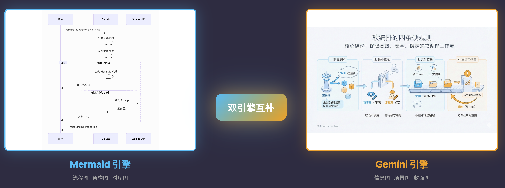

# Smart Illustrator - 智能配图生成器

[English](README.md) | **简体中文**

[](https://opensource.org/licenses/MIT)
[](#状态说明)



Claude Code 的智能文章配图 Skill，采用**双引擎系统**：根据内容类型自动选择 Mermaid（结构化图表）或 ModelScope（创意视觉）。

## 状态说明

> **状态：实验性**
>
> - 这是一个公开原型，适用于我的演示场景，但尚未覆盖所有输入规模和边缘情况。
> - 输出质量因模型版本和输入结构而异，结果可能有波动。
> - 我的主要目标是展示工具和系统如何协同工作，而非维护这个代码库。
> - 如遇问题，请提交可复现的案例（输入 + 输出文件 + 复现步骤）。

## 为什么选择 Smart Illustrator？

为文章配图很费时间：手动设计需要数小时，图库图片缺乏定制性，通用 AI 工具不理解文章结构。Smart Illustrator 结合智能位置检测、双引擎系统（Mermaid + Gemini）和封面学习，几分钟内生成符合上下文的插图。

**适合谁用：** Newsletter 作者、YouTube 创作者、技术博客作者、课程讲师。

**什么时候用：** 需要为文章生成高质量插图、基于最佳实践生成 YouTube 封面图、或保持内容系列视觉风格一致时。

## 背景：我之前的 Make 工作流版本（含自动配图 + 自动发公众号）

在把这条链路做成 Skill 之前，我已经用 Make 跑通过完整工作流：
**搜索 → 写作 → 自动配图 → 微信公众号排版/发布**。

如果你更想看"工作流版"的实现原理与设计取舍，这期视频讲得很细：
https://youtu.be/TbyJ3imLuXQ

## 功能特性

- **双引擎系统**：根据内容类型自动选择 Mermaid 或 ModelScope
- **智能位置识别**：分析文章结构，识别最佳配图位置
- **10+ 配图类型**：流程图、时序图、思维导图、概念图、对比图、场景图、隐喻图...
- **可扩展风格系统**：浅色、深色、极简、封面，支持自定义风格
- **封面图模式**：生成高点击率的 YouTube 缩略图，内置最佳实践
- **多平台尺寸**：YouTube、公众号、Twitter、小红书等预设尺寸
- **断点续传**：跳过已生成的图片，支持重新生成指定图片
- **品牌可定制**：修改 `styles/` 目录即可应用你的品牌风格
- **多后端支持**：Mermaid CLI 生成图表，Gemini API 生成创意视觉（2K 分辨率）

## 什么是 Skills？

Skills 是 [Claude Code](https://docs.anthropic.com/en/docs/claude-code) 的 prompt 扩展，赋予 Claude 专业能力。与需要复杂配置的 MCP 服务器不同，Skills 是简单的 Markdown 文件，Claude 按需加载。

## 安装

### 前置要求

- 已安装 [Claude Code CLI](https://docs.anthropic.com/en/docs/claude-code)
- [Bun](https://bun.sh/) 运行时（用于脚本）
- [Mermaid CLI](https://github.com/mermaid-js/mermaid-cli)（用于图表导出）：`npm install -g @mermaid-js/mermaid-cli`
- ModelScope API Key（可选，用于创意视觉）：https://modelscope.cn/my/myaccesstoken

### 方式 A：手动安装（推荐）

```bash
# 克隆到 Claude Code Skills 目录
git clone https://github.com/axtonliu/smart-illustrator.git ~/.claude/skills/smart-illustrator
```

### 方式 B：复制单独文件

```bash
# 如果只需要 Skill 本身，不需要脚本
cp -r smart-illustrator/SKILL.md ~/.claude/skills/smart-illustrator/
cp -r smart-illustrator/styles ~/.claude/skills/smart-illustrator/
```

## 使用方法

### 基本用法

```bash
# 分析文章并自动生成配图（默认）
/smart-illustrator path/to/article.md

# 只输出 prompt，不自动生成图片
/smart-illustrator path/to/article.md --prompt-only

# 指定风格（从 styles/ 目录加载）
/smart-illustrator path/to/article.md --style light     # 浅色风格（默认）
/smart-illustrator path/to/article.md --style dark      # 深色高对比风格
/smart-illustrator path/to/article.md --style minimal   # 极简风格

# 列出可用风格
/smart-illustrator --list-styles

# 不生成封面图
/smart-illustrator path/to/article.md --no-cover

# 指定配图数量
/smart-illustrator path/to/article.md --count 5
```

### 参数说明

| 参数 | 默认值 | 说明 |
|------|--------|------|
| `--mode` | `article` | 模式：`article`、`slides` 或 `cover` |
| `--platform` | `youtube` | 封面平台：`youtube`/`wechat`/`twitter`/`xiaohongshu`/`landscape`/`square` |
| `--topic` | - | 封面主题（可替代文章路径，仅 cover 模式） |
| `--description` | - | 封面视觉方向（仅 cover 模式） |
| `--prompt-only` | `false` | 只输出 prompt，不调用 API 生成图片 |
| `--style` | `light` | 风格名称，加载 `styles/style-{name}.md` |
| `--list-styles` | - | 列出 `styles/` 目录下所有可用风格 |
| `--no-cover` | `false` | 不生成封面图（article 模式） |
| `--count` | 自动 | 配图数量（根据文章长度自动判断） |
| `--ref` | - | 参考图路径（可多次使用，最多 3 张）|
| `--ref-weight` | `1.0` | 参考图权重（0.0-1.0，暂未实现） |
| `-c, --candidates` | `1` | 生成候选图数量（最多 4 张），用于 Quality Router |

### 配图数量建议

| 文章长度 | 建议数量 |
|----------|----------|
| 短文（< 1000 字） | 1-2 张 |
| 中篇（1000-3000 字） | 2-4 张 |
| 长文（> 3000 字） | 4-6 张 |
| 教程/指南 | 每个主要步骤 1 张 |

### 输出文件

```
article.md                    # 原文
article-image.md              # 带配图的文章（核心输出）
article-cover.png             # 封面图（16:9）
article-image-01.png          # 正文配图（3:4）
article-image-02.png
article-image-03.png
```

### 脚本手动使用

#### generate-image.ts（单张图片）

```bash
export GEMINI_API_KEY=your_key

# 从 prompt 文本生成
npx -y bun ~/.claude/skills/smart-illustrator/scripts/generate-image.ts \
  --prompt "一张展示概念的图..." \
  --output image.png

# 从 prompt 文件生成
npx -y bun ~/.claude/skills/smart-illustrator/scripts/generate-image.ts \
  --prompt-file prompt.md \
  --output image.png
```

| 选项 | 说明 |
|------|------|
| `-p, --prompt` | 图片描述文本 |
| `-f, --prompt-file` | 从文件读取 prompt |
| `-o, --output` | 输出路径（默认：generated.png） |
| `-m, --model` | 模型（默认：Tongyi-MAI/Z-Image-Turbo） |
| `-r, --ref` | 参考图路径（可多次使用，最多 3 张） |
| `--ref-weight` | 参考图权重（0.0-1.0，暂未实现） |
| `-c, --candidates` | 生成候选图数量（最多 4 张） |
| `--size` | 图片尺寸：`default` 或 `2k` |
| `--provider` | API 提供商：`openrouter` 或 `modelscope` |

#### batch-generate.ts（批量生成）

```bash
export GEMINI_API_KEY=your_key

npx -y bun ~/.claude/skills/smart-illustrator/scripts/batch-generate.ts \
  --config slides.json \
  --output-dir ./images \
  --prefix SKILL_01
```

| 选项 | 说明 |
|------|------|
| `-c, --config` | JSON 配置文件（必需） |
| `-o, --output-dir` | 输出目录（默认：./illustrations） |
| `-m, --model` | 模型（默认：gemini-3-pro-image-preview） |
| `-d, --delay` | 请求间隔毫秒数（默认：2000） |
| `-p, --prefix` | 文件名前缀（默认：从配置文件名提取） |
| `-r, --regenerate` | 重新生成指定图片（如 "3" 或 "3,5,7"） |
| `-f, --force` | 强制重新生成所有图片（忽略已存在的） |

**断点续传**：默认会跳过输出目录中已存在的图片。这允许中断后继续生成，无需重新生成已完成的图片。

输出：`{prefix}-01.png`、`{prefix}-02.png` 等。

#### mermaid-export.ts（Mermaid 转 PNG）

```bash
# 从 .mmd 文件导出
npx -y bun ~/.claude/skills/smart-illustrator/scripts/mermaid-export.ts \
  --input diagram.mmd \
  --output diagram.png

# 从内联内容导出
npx -y bun ~/.claude/skills/smart-illustrator/scripts/mermaid-export.ts \
  --content "flowchart LR
    A[开始] --> B[结束]" \
  --output simple.png \
  --theme dark
```

| 选项 | 说明 |
|------|------|
| `-i, --input` | 输入 .mmd 文件路径 |
| `-c, --content` | Mermaid 图表内容（替代方式） |
| `-o, --output` | 输出路径（默认：output.png） |
| `-t, --theme` | 主题：`light`（默认）或 `dark` |
| `-w, --width` | 图片宽度（像素） |
| `-H, --height` | 图片高度（像素） |

## PPT/Slides 生成模式

除了文章配图，此 Skill 还能为 PPT/Keynote 生成批量信息图。

### 适用场景

| 模式 | 用途 | 输出 |
|------|------|------|
| **Article 模式** | 博客、Newsletter | 3-5 张配图插入文章 |
| **Slides 模式** | 视频 B-roll、演示文稿 | 8-15 张独立信息图 |

### 批量生成的 JSON 格式

使用 `pictures[]` 数组格式，配合明确的批处理规则：

```json
{
  "instruction": "请为我绘制 7 张图片（generate 7 images）。你是一位「信息图绘制者」。请逐条执行 pictures 数组：每个 id 对应 1 张独立的 16:9 信息图，严禁合并，严禁只输出文字描述。",
  "batch_rules": {
    "total": 7,
    "one_item_one_image": true,
    "aspect_ratio": "16:9",
    "do_not_merge": true
  },
  "fallback": "如果无法一次生成全部图片：请输出 7 条独立的单图绘图指令...",
  "style": "[完整的 style prompt - 见 styles/style-light.md]",
  "pictures": [
    { "id": 1, "topic": "封面", "content": "课程名称\n\n章节标题\n\n学习目标..." },
    { "id": 2, "topic": "核心概念", "content": "[原始内容]" }
  ]
}
```

### 关键规则

1. **使用 `pictures[]` 数组** - 数组结构有助于 Gemini 进入"逐条执行"模式进行批量生成。

2. **添加图片生成触发词** - 必须包含"请为我绘制 N 张图片（generate N images）"来触发图片生成模式。

3. **角色设定为"绘制者"而非"导演"** - 使用"信息图绘制者"（illustrator）而非"视觉导演"（director）来触发实际绘图行为。

4. **instruction 与 style 分离** - `instruction` = 任务 + 角色；`style` = 纯视觉规则。

5. **传递完整 style** - 包含 `styles/style-light.md` 的完整内容，不要简化。

6. **内容粒度** - 按信息密度判断，而非机械地按 H2 标题分割。

### 封面品牌规则（PPT 模式）

对于课程/系列内容，封面 slide（`id: 1`）应包含：

```json
{
  "id": 1,
  "topic": "封面",
  "content": "Agent Skills 完全指南\n\n第4节：渐进式披露与 Description 优化\n\n学习目标：理解 Progressive Disclosure 机制"
}
```

结构：
- **系列名称**：如 "Agent Skills 完全指南"
- **章节序号**：如 "第4节"
- **章节标题**：如 "渐进式披露与 Description 优化"
- **学习目标**（可选）

### 输出方式选项（适用于所有模式）

`--prompt-only` 是**全局选项**，适用于 Article、Slides、Cover 等所有模式：

| 输出方式 | 参数 | 说明 | 需要 API |
|----------|------|------|----------|
| 直接生成图片 | 默认 | 调用 Gemini API 生成图片 | ✅ 需要 |
| 输出 JSON Prompt | `--prompt-only` | 复制到 Gemini Web 手动生成 | ❌ 不需要 |

**示例组合：**

```bash
# Slides 模式 + 直接生成图片（需要 API）
/smart-illustrator script.md --mode slides

# Slides 模式 + 只输出 JSON（无需 API）
/smart-illustrator script.md --mode slides --prompt-only

# Article 模式 + 直接生成图片（需要 API）
/smart-illustrator article.md

# Article 模式 + 只输出 JSON（无需 API）
/smart-illustrator article.md --prompt-only
```

**手动批量生成（用于 JSON prompt 输出后）：**

```bash
export GEMINI_API_KEY=your_key

npx -y bun ~/.claude/skills/smart-illustrator/scripts/batch-generate.ts \
  --config slides.json \
  --output-dir ./images
```

完整示例见 `references/slides-prompt-example.json`。

> **💡 使用提示**：在 ModelScope 中使用 JSON 批量生成图片并非 100% 成功率。如果遇到生成失败，可以：
> 1. 重试 1-3 次，通常能成功
> 2. 如果多次重试仍失败，将 JSON 中的 `pictures` 逐条复制到 Gemini 单独生成

## 参考图模式（Style-lock）

使用参考图引导生成图片的视觉风格，确保系列图片风格一致。

```bash
# 使用单张参考图
/smart-illustrator article.md --ref style-ref.png

# 使用多张参考图（最多 3 张）
/smart-illustrator article.md --ref ref1.png --ref ref2.png

# 结合 Quality Router 使用
/smart-illustrator article.md --ref style-ref.png -c 2
```

**限制**：
- 参考图功能仅支持 ModelScope API（OpenRouter 不支持多模态输入）
- 使用参考图时会自动从 OpenRouter 切换到 ModelScope
- 最多 3 张参考图
- 参考图建议尺寸：512-1024px，过大会增加 API 延迟和费用

---

## Quality Router（多候选图生成）

生成多张候选图供用户选择，提高最终图片质量。

```bash
# 生成 2 张候选图
/smart-illustrator article.md --candidates 2

# 简写形式
/smart-illustrator article.md -c 2

# 结合参考图使用
/smart-illustrator article.md --ref style-ref.png -c 2
```

**输出**：
- 单候选（默认）：`output.png`
- 多候选：`output-1.png`、`output-2.png`

**工作流程**：
1. 按指定数量生成图片
2. 输出所有候选图路径
3. 用户选择最佳结果

**建议**：
- 日常使用 1 张（节省成本）
- 重要场景（封面图、课程宣传）使用 2 张
- 最多支持 4 张

---

## 配置文件（风格复用）

通过配置文件保存常用参数，实现系列内容（课程、Newsletter）的风格一致性。

### 配置文件位置

**优先级：CLI 参数 > 项目级配置 > 用户级配置**

| 位置 | 路径 | 用途 |
|------|------|------|
| 项目级 | `{工作目录}/.smart-illustrator/config.json` | 特定项目的风格配置（如某个课程系列） |
| 用户级 | `~/.smart-illustrator/config.json` | 用户全局默认风格 |

### 配置文件格式

```json
{
  "references": [
    "./refs/style-ref-01.png",
    "./refs/style-ref-02.png"
  ]
}
```

**支持的配置项**：
- `references`：参考图路径数组（相对路径相对于配置文件所在目录）

### 使用示例

```bash
# 首次配置：为课程系列设置风格
cd ~/my-course
/smart-illustrator article-01.md --ref ./refs/style-1.png --save-config

# 之后生成：自动使用配置
/smart-illustrator article-02.md  # 自动应用参考图

# 临时覆盖：使用不同参考图
/smart-illustrator article-03.md --ref ./other-ref.png

# 完全忽略配置
/smart-illustrator article-04.md --no-config

# 保存到用户级配置（全局默认）
/smart-illustrator article.md --ref ./my-style.png --save-config-global
```

### 配置加载规则

1. 读取用户级配置（如果存在）
2. 读取项目级配置（如果存在，覆盖用户级）
3. 应用命令行参数（覆盖配置文件）

**典型场景**：
- **课程系列**：项目目录下保存 `.smart-illustrator/config.json`，所有章节自动使用统一风格
- **个人默认**：用户目录下保存 `~/.smart-illustrator/config.json`，作为全局默认风格
- **临时调整**：使用 `--ref` 参数临时覆盖配置，不影响保存的配置

---

## Cover 模式（封面图生成）

为 YouTube、公众号、Twitter 等生成高点击率封面图，内置 YouTuber 最佳实践。

```bash
# 从文章生成 YouTube 封面
/smart-illustrator path/to/article.md --mode cover --platform youtube

# 指定主题生成
/smart-illustrator --mode cover --platform youtube --topic "Claude 4 深度评测"

# 指定视觉方向
/smart-illustrator --mode cover --platform wechat --description "对比图 + 科技感"
```

### 支持的平台

所有输出均为 **2K 分辨率**（如 16:9 约为 2816×1584）。

| 平台 | 代码 | 宽高比 |
|------|------|--------|
| YouTube | `youtube` | 16:9 |
| 公众号 | `wechat` | 2.35:1 |
| Twitter/X | `twitter` | 1.91:1 |
| 小红书 | `xiaohongshu` | 3:4 |
| 通用横版 | `landscape` | 16:9 |
| 通用方形 | `square` | 1:1 |

### 封面设计最佳实践

本项目内置 YouTube 封面设计最佳实践（基于头部 YouTuber 研究）。

**核心原则**：
- **3 秒法则**：极短时间传达主题+价值+紧迫感
- **高对比设计**：深背景+亮主体，明度差 ≥50%
- **视觉焦点唯一**：一张封面只有一个重点
- **文字精简有力**：3-6 字，粗体无衬线
- **好奇心缺口**：让人不得不点

**详细指南**：完整的设计原则、平台规格、A/B 测试清单见 [references/cover-best-practices.md](references/cover-best-practices.md)

> 💡 这些实践由 [@axtonliu](https://twitter.com/axtonliu) 研究总结。
> 如在项目中使用，欢迎注明来源并分享你的成果。

### 技术内容的视觉隐喻

| 概念 | 隐喻 |
|------|------|
| AI 助手 | 协作的两只手、对话气泡组合 |
| 效率提升 | 向上箭头、阶梯、火箭轨迹 |
| 自动化 | 齿轮组、流水线节点 |
| 学习成长 | 种子→大树、阶梯上升 |
| 问题解决 | 迷宫出口、拼图完成 |

### 封面学习功能（持续优化）

从高表现封面中学习，持续提升生成质量：

```bash
# 学习一张高表现封面
/smart-illustrator --learn-cover ./my-best-thumbnail.png

# 带备注学习（如 CTR 数据）
/smart-illustrator --learn-cover ./cover.png --learn-note "CTR 8.5%,震惊表情效果好"

# 查看学习记录
/smart-illustrator --show-learnings

# 生成多风格封面（自动应用学习模式）
/smart-illustrator --mode cover --platform youtube --topic "Claude 4 评测" --varied
```

**学习工作流程**：

1. **AI 自动分析**：构图、配色、文字使用、情绪表达、视觉焦点
2. **提取成功模式**：记录值得复用的设计要素
3. **持久化学习**：保存到 `~/.smart-illustrator/cover-learnings.md`
4. **自动应用**：后续生成封面时自动加载学到的模式

**Varied 模式（多风格生成）**：

- 一次生成 2 张不同风格的封面供选择
- **Candidate 1**：戏剧性高对比（强视觉冲击，适合娱乐/震惊类内容）
- **Candidate 2**：极简专业（克制高级，适合技术/教育类内容）
- 两种风格都会自动应用历史学习模式

### Prompt 自定义（高级）

所有 AI prompt 集中在 `prompts/` 目录，便于自定义和迭代：

```
prompts/
  ├── README.md              # Prompt 管理说明
  ├── varied-styles.md       # Varied 模式的两种风格提示
  └── learning-analysis.md   # 封面学习分析 prompt
```

**修改 prompt**：

- 直接编辑 Markdown 文件，无需改代码
- 修改后自动生效，无需重启
- 详细说明见 `prompts/README.md`

**与风格系统关系**：

- **风格文件**（`styles/*.md`）：定义核心设计规则（构图、配色、禁忌等）
- **Prompt 模板**（`prompts/*.md`）：定义生成策略（风格提示、分析重点等）
- 两者配合使用，风格文件是基础，prompt 模板是补充

---

## 智能位置识别

Skill 分析文章结构，识别最佳配图位置：

| 信号 | 配图价值 |
|------|----------|
| 抽象概念首次出现 | 高 - 帮助建立心智模型 |
| 流程/步骤描述 | 高 - 可视化比文字更清晰 |
| 对比/选择论述 | 高 - 左右对比一目了然 |
| 数据/统计引用 | 中 - 数字可视化更有冲击力 |
| 章节转折点 | 中 - 提供视觉喘息 |
| 情感/故事高潮 | 中 - 增强共鸣 |

---

## 双引擎系统

Skill 根据内容自动选择最佳渲染引擎：

| 引擎 | 适用场景 | 输出特点 |
|------|----------|----------|
| **Mermaid** | 结构化图表（流程图、时序图、架构图） | 专业、精确、可编辑 |
| **ModelScope** | 创意视觉（隐喻图、场景图、信息图） | 艺术、氛围、品牌化 |

## 配图类型

| 类型 | 引擎 | 适用场景 | 语法/风格 |
|------|------|----------|-----------|
| `process` | Mermaid | 步骤、工作流 | `flowchart` |
| `architecture` | Mermaid | 系统组件 | `block-beta` |
| `sequence` | Mermaid | API 调用、交互 | `sequenceDiagram` |
| `mindmap` | Mermaid | 知识结构 | `mindmap` |
| `state` | Mermaid | 状态转换 | `stateDiagram` |
| `concept` | ModelScope | 抽象概念 | 中心辐射 |
| `comparison` | ModelScope | A vs B、对比 | 左右分栏 |
| `data` | ModelScope | 统计、趋势 | 信息图风格 |
| `scene` | ModelScope | 故事、场景 | 叙事插画 |
| `metaphor` | ModelScope | 类比、象征 | 创意视觉 |
| `cover` | ModelScope | 文章封面 | 16:9 深色高对比 |

### 类型 × 构图参考

| 类型 | 推荐构图 | 元素 |
|------|----------|------|
| concept | 中心辐射、层级结构 | 核心图标 + 周围要素 |
| process | 横向/纵向流程 | 节点 + 箭头 + 标签 |
| comparison | 左右/上下分栏 | 两栏 + 对应项 |
| data | 图表风格 | 数字突出 + 图形化 |
| scene | 叙事插画 | 人物 + 环境 + 动作 |
| summary | 卡片网格、要点列表 | 结构化布局 |
| metaphor | 类比画面 | 创意视觉隐喻 |

## 风格系统

### 内置风格

| 风格 | 文件 | 适用场景 |
|------|------|----------|
| 浅色 | `styles/style-light.md` | 正文配图（默认） |
| 深色 | `styles/style-dark.md` | 封面图、营销 |
| 极简 | `styles/style-minimal.md` | 技术文档、白皮书 |
| 封面 | `styles/style-cover.md` | YouTube 缩略图、社交封面（cover 模式） |

### 正文配图：浅色风格

- 3:4 竖版格式
- 浅灰白背景 `#F8F9FA`
- 扁平几何 + 细线勾边
- 详见 `styles/style-light.md`

### 封面图：深色高对比风格

- 16:9 横版格式
- 深空紫背景
- 线性图标 + 玻璃拟态
- 无文字
- 详见 `styles/style-dark.md`

### 自定义风格

创建 `styles/style-{name}.md` 文件，然后使用 `--style {name}` 调用。

## 文件结构

```
smart-illustrator/
├── SKILL.md                  # Skill 定义（Claude Code 入口）
├── CLAUDE.md                 # 项目规则（风格同步、JSON 格式）
├── README.md                 # 英文文档
├── README.zh-CN.md           # 中文文档
├── LICENSE
├── scripts/
│   ├── generate-image.ts     # ModelScope 单张图片生成
│   ├── batch-generate.ts     # ModelScope 批量生成（2K、断点续传）
│   └── mermaid-export.ts     # Mermaid 图表导出为 PNG
├── styles/
│   ├── brand-colors.md       # 品牌色板（可自定义）
│   ├── style-light.md        # 浅色风格 Gemini Prompt（默认）
│   ├── style-dark.md         # 深色风格 Gemini Prompt
│   ├── style-minimal.md      # 极简风格 Gemini Prompt
│   └── style-cover.md        # 封面图风格（cover 模式）
└── references/
    ├── slides-prompt-example.json  # PPT 模式 JSON 格式示例
    └── cover-best-practices.md     # YouTube 封面图最佳实践
```

## 自定义

想使用自己的品牌风格？

### 方式 1：修改现有风格

1. 编辑 `styles/brand-colors.md` 中的颜色值
2. 同步更新 `styles/style-*.md` 文件中的颜色
3. 完成！你的 Skill 现在有了自己的品牌标识。

### 方式 2：添加新风格

1. 创建 `styles/style-{name}.md`（如 `style-corporate.md`）
2. 参考现有风格文件的格式编写
3. 使用 `--style {name}` 调用

### 示例：自定义品牌色板

编辑 `styles/brand-colors.md`：

```markdown
## 核心色
| 你的品牌色 | `#XXXXXX` | 主色调 |

## 点缀色
| 你的强调色 | `#XXXXXX` | 强调色 |
```

## 配置参考

### Mermaid 引擎参数

| 参数 | 值 | 说明 |
|------|-----|------|
| `-s` | `3` | 3 倍缩放，高清输出 |
| `-w` | `1600` | 1600px 宽度 |
| `-b` | `white` | 白色背景（浅色风格） |
| `-t` | `neutral` | 中性主题 |

**完整命令：**
```bash
mmdc -i input.mmd -o output.png -s 3 -w 1600 -b white
```

**Mermaid 最佳实践：**

本 Skill 遵循 [mermaid-visualizer](https://github.com/axtonliu/axton-obsidian-visual-skills) 的风格指南：
- 使用 ID 引用节点，不使用显示文本
- 避免 `数字. 空格` 模式（改用 `①②③` 或 `(1)(2)(3)`）
- 按层级应用一致的颜色编码

### ModelScope 引擎参数

| 参数 | 值 | 说明 |
|------|-----|------|
| 模型 | `gemini-3-pro-image-preview` | 最适合配图 |
| 分辨率 | 2K (2816×1536) | 通过 `imageConfig.imageSize` 设置高分辨率 |
| 正文配图比例 | 3:4 竖版 | 适合嵌入文章 |
| 封面图比例 | 16:9 横版 | 平台就绪格式 |
| 封面图文字 | **无** | 纯视觉，标题由平台显示 |

### 品牌色板（默认：Axton Brand）

| 名称 | 色值 | 用途 |
|------|------|------|
| 深空紫 | `#2F2B42` | 核心色，深色背景 |
| 琥珀橙 | `#F59E0B` | 强调色，高亮，Skills 层 |
| 天空蓝 | `#38BDF8` | 强调色，次级高亮，Agents 层 |
| 浅灰白 | `#F8F9FA` | 浅色背景，中性元素 |

### 风格文件

| 文件 | 用途 | 比例 |
|------|------|------|
| `styles/style-light.md` | 正文配图（默认） | 3:4 竖版 |
| `styles/style-dark.md` | 封面图 | 16:9 横版 |
| `styles/style-minimal.md` | 技术文档 | 3:4 竖版 |
| `styles/brand-colors.md` | 色板参考 | - |

## 成本

使用 ModelScope API 自动生成时：

| 模型 | 价格 | 质量 |
|------|------|------|
| `Tongyi-MAI/Z-Image-Turbo` | 参见 ModelScope 定价 | 2K（默认） |

获取 API Key：https://aistudio.google.com/apikey

## 贡献

欢迎贡献（低维护项目）：

- 可复现的 bug 报告（输入 + 输出 + 步骤 + 环境）
- 文档改进
- 小型 PR（修复/文档）

> **注意**：由于维护能力有限，功能请求可能不会被处理。

## 致谢

本项目基于以下优秀工具构建：

- [Claude Code](https://docs.anthropic.com/en/docs/claude-code) - Anthropic 的 AI 编程助手
- [Mermaid](https://mermaid.js.org/) - 图表绘制工具
- [Mermaid CLI](https://github.com/mermaid-js/mermaid-cli) - Mermaid 命令行接口
- [ModelScope API](https://modelscope.cn/) - 阿里达摩院的图片生成 API
- [Bun](https://bun.sh/) - 快速 JavaScript 运行时

## 许可证

MIT 许可证 - 详见 [LICENSE](LICENSE)。

---

## 作者

**Axton Liu** - AI 教育者 & 创作者

- 网站：[axtonliu.ai](https://www.axtonliu.ai)
- YouTube：[@AxtonLiu](https://youtube.com/@AxtonLiu)
- Twitter/X：[@axtonliu](https://twitter.com/axtonliu)

### 了解更多

- [Agent Skills 资源库](https://www.axtonliu.ai/agent-skills) - Claude Code Skills 合集与指南
- [AI 精英周刊 Newsletter](https://www.axtonliu.ai/newsletters/ai-2) - 每周 AI 洞察
- [免费 AI 课程](https://www.axtonliu.ai/axton-free-course) - 开始学习 AI

---

MIT License © [Axton Liu](https://www.axtonliu.ai)
