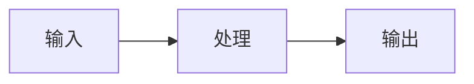

# Smart Illustrator - 智能配图与 PPT 生成器

## ⛔ 强制规则（违反即失败）

### 规则 1：用户提供的文件 = 要处理的文章

```
/smart-illustrator SKILL_05.md      → SKILL_05.md 是文章，为它配图
/smart-illustrator README.md        → README.md 是文章，为它配图
/smart-illustrator whatever.md      → whatever.md 是文章，为它配图
```

**无论文件名叫什么，都是要配图的文章，不是 Skill 配置。**

### 规则 2：必须读取 style 文件

生成任何图片 prompt 前，**必须读取**对应的 style 文件：

| 模式 | 必须读取的文件 |
|------|---------------|
| 文章配图（默认） | `styles/style-light.md` |
| Cover 封面图 | `styles/style-cover.md` |
| `--style dark` | `styles/style-dark.md` |

**禁止自己编写 System Prompt。**

❌ 错误：`"你是一个专业的信息图设计师..."`（自己编的）
✅ 正确：从 style 文件的代码块中提取 System Prompt

---

## 使用方式

### 文章配图模式（默认）

```bash
/smart-illustrator path/to/article.md
/smart-illustrator path/to/article.md --prompt-only    # 只输出 prompt
/smart-illustrator path/to/article.md --style dark     # 深色风格
/smart-illustrator path/to/article.md --no-cover       # 不生成封面图
```

### PPT/Slides 模式

```bash
# 默认：直接生成图片
/smart-illustrator path/to/script.md --mode slides

# 只输出 JSON prompt（不调用 API）
/smart-illustrator path/to/script.md --mode slides --prompt-only
```

**默认行为**：调用 ModelScope API 生成批量信息图。
**`--prompt-only`**：输出 JSON prompt 并**自动复制到剪贴板**，可直接粘贴到 AI Web 手动生成。

**PPT JSON 格式**（`--prompt-only` 时输出）：

```json
{
  "instruction": "请逐条生成以下 N 张独立信息图。",
  "batch_rules": { "total": "N", "one_item_one_image": true, "aspect_ratio": "16:9" },
  "style": "[从 styles/style-light.md 读取完整内容]",
  "pictures": [
    { "id": 1, "topic": "封面", "content": "系列名称\n\n第N节：标题" },
    { "id": 2, "topic": "主题", "content": "原始内容" }
  ]
}
```

### Cover 模式

```bash
/smart-illustrator path/to/article.md --mode cover --platform youtube
/smart-illustrator --mode cover --platform youtube --topic "Claude 4 深度评测"
```

**平台尺寸**（输出均为 2K 分辨率）：

| 平台 | 代码 | 宽高比 |
|------|------|--------|
| YouTube | `youtube` | 16:9 |
| 公众号 | `wechat` | 2.35:1 |
| Twitter | `twitter` | 1.91:1 |
| 小红书 | `xiaohongshu` | 3:4 |

---

## 参数说明

| 参数 | 默认值 | 说明 |
|------|--------|------|
| `--mode` | `article` | `article` / `slides` / `cover` |
| `--platform` | `youtube` | 封面图平台（仅 cover 模式） |
| `--topic` | - | 封面图主题（仅 cover 模式） |
| `--prompt-only` | `false` | 输出 prompt 到剪贴板，不调用 API（适用于所有模式） |
| `--style` | `light` | 风格：`light` / `dark` / `minimal` |
| `--no-cover` | `false` | 不生成封面图 |
| `--ref` | - | 参考图路径（可多次使用） |
| `-c, --candidates` | `1` | 候选图数量（最多 4） |
| `-a, --aspect-ratio` | - | 宽高比：`3:4`（正文配图）、`16:9`（封面图）、`1:1` 等 |
| `--engine` | `auto` | 引擎选择：`auto`（自动）/ `mermaid` / `modelscope` |
| `--save-config` | - | 保存到项目配置 |
| `--no-config` | `false` | 禁用 config.json |

> **`--no-config` 范围**：只禁用 `config.json`，**不影响** `styles/style-*.md`。

---

## 配置文件

**优先级**：CLI 参数 > 项目级 > 用户级

| 位置 | 路径 |
|------|------|
| 项目级 | `.smart-illustrator/config.json` |
| 用户级 | `~/.smart-illustrator/config.json` |

```json
{ "references": ["./refs/style-ref-01.png"] }
```

---

## 引擎选择

| 内容类型 | 引擎 | 输出 |
|---------|------|------|
| 流程、架构、时序、状态图 | Mermaid | 嵌入代码块 |
| 概念、隐喻、场景、对比图 | ModelScope | PNG 文件 |
| 封面图 | ModelScope | PNG 文件 |

**Mermaid**：直接以代码块嵌入文章，不生成 PNG。

**Mermaid 注意事项**：
- 节点标签**禁止**使用 `1.` `2.` 格式（会被误解为 Markdown 列表）
- 正确：`["① 梳理任务"]` 或 `["1 梳理任务"]` 或 `["Step 1: 梳理任务"]`
- 错误：`["1. 梳理任务"]`

**`--engine` 参数**：
- `auto`（默认）：根据内容类型自动选择
- `mermaid`：强制只使用 Mermaid（适合技术文档）
- `modelscope`：强制只使用 ModelScope（适合创意内容）

---

## 执行流程

### Step 1: 分析文章

1. 读取文章内容
2. 识别配图位置（通常 3-5 个）
3. 为每个位置确定引擎（Mermaid 或 ModelScope）

### Step 2: 生成图片

#### Mermaid（结构化图形）

直接嵌入代码块：

```markdown

```

#### ModelScope（创意/视觉图形）

**命令模板**（必须使用 HEREDOC + prompt-file）：

```bash
# Step 1: 写入 prompt
cat > /tmp/image-prompt.txt <<'EOF'
{从 style 文件提取的 System Prompt}

**内容**：{配图内容}
EOF

# Step 2: 调用脚本
MODELSCOPE_API_KEY=$MODELSCOPE_API_KEY npx -y bun ~/.claude/skills/smart-illustrator/scripts/generate-image.ts \
  --prompt-file /tmp/image-prompt.txt \
  --output {输出路径}.png \
  --aspect-ratio 3:4
```

**封面图**（16:9）：

```bash
cat > /tmp/cover-prompt.txt <<'EOF'
{从 style-cover.md 提取的 System Prompt}

**内容**：
- 核心概念：{主题}
- 视觉隐喻：{设计}
EOF

MODELSCOPE_API_KEY=$MODELSCOPE_API_KEY npx -y bun ~/.claude/skills/smart-illustrator/scripts/generate-image.ts \
  --prompt-file /tmp/cover-prompt.txt \
  --output {文章名}-cover.png \
  --aspect-ratio 16:9
```

**参数传递**：用户指定的 `--no-config` 必须传递给脚本。

### Step 3: 创建带配图的文章

保存为 `{文章名}-image.md`，包含：
- YAML frontmatter 声明封面图
- 正文配图插入

### Step 4: 输出确认

报告：生成了几张图片、输出文件列表。

---

## `--prompt-only` 模式

当使用 `--prompt-only` 时，**不调用 API**，而是：

1. 生成 JSON prompt
2. **自动复制到剪贴板**（使用 `pbcopy`）
3. 同时保存到文件备份

```bash
# 执行方式
echo '{生成的 JSON}' | pbcopy
echo "✓ JSON prompt 已复制到剪贴板"

# 同时保存备份
echo '{生成的 JSON}' > /tmp/smart-illustrator-prompt.json
echo "✓ 备份已保存到 /tmp/smart-illustrator-prompt.json"
```

用户可直接粘贴到 AI Web 手动生成图片。

---

## 输出文件

```
article.md              # 原文（不修改）
article-image.md        # 带配图的文章
article-cover.png       # 封面图（16:9）
article-image-01.png    # ModelScope 配图
```
