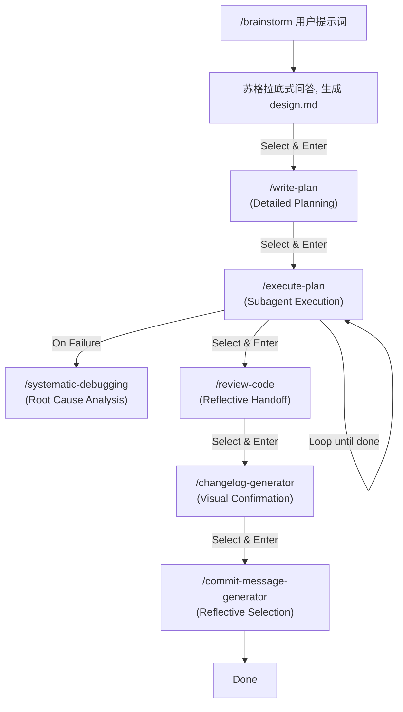

# Learn Claude Code & AI 原生开发工作流实战

本项目包含两大部分核心内容：
1. **Learn Claude Code 学习套件**：一套标准化的 Claude Code 配置工具与最佳实践（Go 语言专用版）。
2. **AI 原生开发工作流实战课程**：极客时间《AI 原生开发工作流实战》课程的全套文档与资源。

## 🛠 Learn Claude Code 学习套件 (Tool Suite)

**Learn Claude Code** 是一个标准化的 Claude Code 配置套件，旨在帮助开发者快速将最佳实践集成到自己的项目中。本版本经过精简重构，专注于 **Golang** 开发环境的优化。

### 核心特性

1.  **规则基石**: `.claude/constitution/constitution.md` 定义了不可动摇的开发原则。
2.  **认知架构**: 深度集成**奥卡姆剃刀**（做减法）、**费曼技巧**（做加法）与**苏格拉底提问法**（做验证），构建自我调节的 AI 思维模型。
3.  **角色化 Agent**: 预设 Architect, Code Reviewer 等专家角色。
4.  **Golang 原生支持**: 提供深度优化的 Go 语言配置模板 (`.claude/profiles/go`)，集成 `gofmt`, `goimports`, `golangci-lint` 等工具链。
5.  **智能体技能库**: 内置 Python 驱动的高级技能（如 `changelog-generator`, `skill-architect`），提供自动变更日志、技能进化等能力（仅依赖系统 Python，无需额外配置）。
6.  **自动化集成**: 通过 `install.sh` 一键将配置注入到你的项目中，支持 macOS 原生 GUI 交互与智能文件合并（Smart Merge）。

---

## 🌊 FlowState: 零摩擦 AI 工作流 (Zero-Friction AI Workflow)

**FlowState** 是本套件的核心工作流引擎，通过智能引导将**提示词优化**、**方案规划**、**代码实现**、**代码审查**、**变更日志**与**提交信息**无缝串联，让开发过程像水一样自然流动。

### 🚀 快速上手 (Quick Start)

#### 1. 安装 (Installation)

**前置要求**: Claude Code CLI, Python 3.8+, Git.

推荐使用 `make` 命令安装：

```bash
make install
```

或者直接运行脚本：

```bash
# 标准安装（复制模式，推荐生产环境）
./scripts/installers/install.sh <你的目标 Go 项目路径>

# 开发安装（软链接模式，推荐开发调试）
./scripts/installers/install.sh --dev <你的目标 Go 项目路径>
```

#### 2. 体验工作流 (The Flow Experience)

安装完成后，在你的项目根目录下：

```bash
/brainstorm "实现一个 Python 斐波那契数列工具"
```

**后续的所有操作，您只需要使用 ⬆️⬇️ 和 Enter 即可完成：**

```text
? [FlowState] Design 阶段已完成。下一步做什么？ (Use arrow keys)
 » 🟢 继续执行 (Write Plan)
   ⚪️ 查看生成的文件 (Review Files)
   ⚪️ 修改需求 (Refine Spec)
   ⚪️ 退出 (Exit)
```

**真正的 "Hands-free" 体验，让您专注于决策而非命令。**

### 🎮 交互模式 (Interaction Model)

本插件采用 **Zero-Friction (零摩擦)** 交互设计：

1.  **全流程智能引导**: 系统主动提示下一步操作。
2.  **方向键导航**: 使用 ↑/↓ 选择，Enter 确认。
3.  **一键直达**: 确认后自动执行命令，无需手动输入。

### 📊 工作流全景 (Interactive Workflow)



**全程可视化进度**:
`[✔ Design] → [✔ Plan] → [➤ Execute] → [Review] → [Changelog] → [Commit]`

### 🛠️ 核心命令详解
