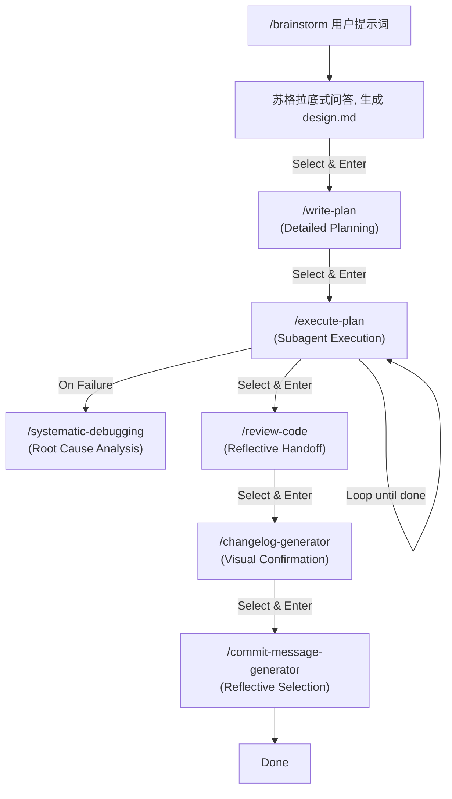
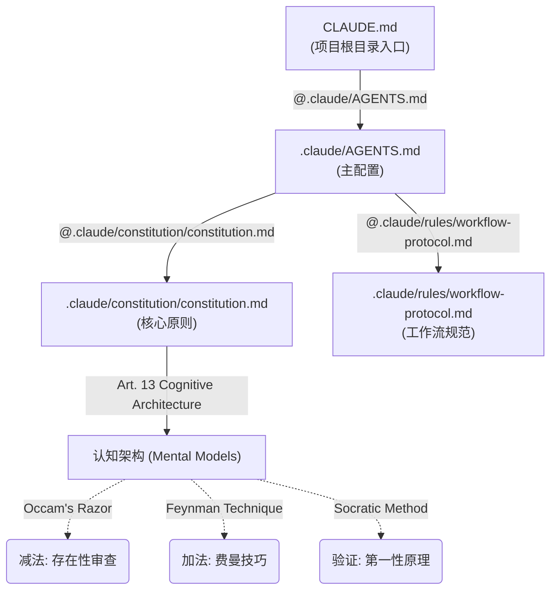

# Learn Claude Code & AI 原生开发工作流实战

本项目包含两大部分核心内容：
1. **Learn Claude Code 学习套件**：一套标准化的 Claude Code 配置工具与最佳实践（Go 语言专用版）。
2. **AI 原生开发工作流实战课程**：极客时间《AI 原生开发工作流实战》课程的全套文档与资源。

## 🛠 Learn Claude Code 学习套件 (Tool Suite)

**Learn Claude Code** 是一个标准化的 Claude Code 配置套件，旨在帮助开发者快速将最佳实践集成到自己的项目中。本版本经过精简重构，专注于 **Golang** 开发环境的优化。

### 核心特性

1.  **规则基石**: `.claude/constitution/constitution.md` 定义了不可动摇的开发原则。
2.  **认知架构**: 深度集成**奥卡姆剃刀**（做减法）、**费曼技巧**（做加法）与**苏格拉底提问法**（做验证），构建自我调节的 AI 思维模型。
3.  **角色化 Agent**: 预设 Architect, Code Reviewer 等专家角色。
4.  **Golang 原生支持**: 提供深度优化的 Go 语言配置模板 (`.claude/profiles/go`)，集成 `gofmt`, `goimports`, `golangci-lint` 等工具链。
5.  **智能体技能库**: 内置 Python 驱动的高级技能（如 `changelog-generator`, `skill-architect`），提供自动变更日志、技能进化等能力（仅依赖系统 Python，无需额外配置）。
6.  **自动化集成**: 通过 `install.sh` 一键将配置注入到你的项目中，支持 macOS 原生 GUI 交互与智能文件合并（Smart Merge）。

---

## 🌊 FlowState: 零摩擦 AI 工作流 (Zero-Friction AI Workflow)

**FlowState** 是本套件的核心工作流引擎，通过智能引导将**提示词优化**、**方案规划**、**代码实现**、**代码审查**、**变更日志**与**提交信息**无缝串联，让开发过程像水一样自然流动。

### 🚀 快速上手 (Quick Start)

#### 1. 安装 (Installation)

**前置要求**: Claude Code CLI, Python 3.8+, Git.

推荐使用一键安装脚本：

**macOS / Linux / Windows (Git Bash):**
```bash
/bin/bash -c "$(curl -fsSL https://raw.githubusercontent.com/learn-claude-code/learn-claude-code/main/install.sh)"
```

**Windows (PowerShell):**
```powershell
irm https://raw.githubusercontent.com/learn-claude-code/learn-claude-code/main/install.ps1 | iex
```

如果你已经克隆了本仓库，也可以手动运行：

```bash
# 标准安装（复制模式，推荐生产环境）
./install.sh <你的目标 Go 项目路径>

# 开发安装（软链接模式，推荐开发调试）
./install.sh --dev <你的目标 Go 项目路径>
```

#### 2. 体验工作流 (The Flow Experience)

安装完成后，在你的项目根目录下：

```bash
/brainstorm "实现一个 Python 斐波那契数列工具"
```

**后续的所有操作，您只需要使用 ⬆️⬇️ 和 Enter 即可完成：**

```text
? [FlowState] Design 阶段已完成。下一步做什么？ (Use arrow keys)
 » 🟢 继续执行 (Write Plan)
   ⚪️ 查看生成的文件 (Review Files)
   ⚪️ 修改需求 (Refine Spec)
   ⚪️ 退出 (Exit)
```

**真正的 "Hands-free" 体验，让您专注于决策而非命令。**

### 🎮 交互模式 (Interaction Model)

本插件采用 **Zero-Friction (零摩擦)** 交互设计：

1.  **全流程智能引导**: 系统主动提示下一步操作。
2.  **方向键导航**: 使用 ↑/↓ 选择，Enter 确认。
3.  **一键直达**: 确认后自动执行命令，无需手动输入。

### 📊 工作流全景 (Interactive Workflow)



**全程可视化进度**:
`[✔ Design] → [✔ Plan] → [➤ Execute] → [Review] → [Changelog] → [Commit]`

### 🛠️ 核心命令详解

1.  **`/brainstorm`** (Design): 苏格拉底式需求挖掘与架构设计。
2.  **`/write-plan`** (Plan): 生成详细的实施计划与微任务。
3.  **`/execute-plan`** (Execute): 批量执行开发任务，自动触发 TDD 流程。
4.  **`/systematic-debugging`**: (Debug) 遇到问题时的标准化调试流程。
5.  **`/review-code`**: (Review) 智能代码审查与修复引导。
6.  **`/changelog-generator`**: 自动更新 CHANGELOG.md。
7.  **`/commit-message-generator`**: 生成符合规范的 Commit Message。

### 📂 统一生成物管理 (Artifact Management)

Superpowers 将自动管理以下文档：
- `docs/design/`: 需求分析与设计文档
- `docs/plans/`: 实施计划与任务清单
- `docs/logs/`: 调试日志与分析报告

### 🤫 静默模式与文件优先 (Silent Mode & File-First)

为了保持会话窗口的简洁，Claude Code 将遵循 **"Silent Mode"** 原则：
-   **长文本自动归档**：任何超过 10 行的详细分析、调试日志或长篇推理，都会自动写入 `fib/analysis_*.md` 或 `fib/scratchpad.md`，并在会话中仅保留摘要和文件链接。
-   **命令输出重定向**：产生大量输出的命令（如测试日志）将被重定向到文件（如 `fib/test_run.log`）。
-   **"Don't print it if you can file it"**：让你的聊天界面始终保持清爽、专注于核心决策。

---

## 🏗 Golang 开发指南

本套件为 Golang 项目提供了开箱即用的最佳实践配置。

### 构建与运行 (Makefile)

安装完成后，你的项目将获得标准化的 Makefile 支持：

- **构建项目**: `make build`
- **运行测试**: `make test`
- **代码格式化与检查**: `make lint`
- **清理构建产物**: `make clean`

### 评审与元信息约定

- **评审入口**: 使用 `.claude/commands/review-code.md` 统一执行差异审查与全量审查。
- **计划前置**: 变更触及 3 个以上文件或跨模块时，先进入 /plan 明确范围与验收标准。
- **模块元信息**: 每个模块目录需要 README，说明 Role/Logic/Constraints 与子模块清单。
- **源文件头部**: 源文件前三行包含 INPUT/OUTPUT/POS，变更后需要同步更新。
- **交付卫生**: 本地产物与日志不得进入仓库，确保 `.gitignore` 覆盖。

#### 模板示例

模块 README 模板

```
# <模块名称>

## Role
<该模块在系统中的角色与职责>

## Logic
<该模块的核心逻辑与工作方式>

## Constraints
<使用方必须遵循的约束/不变量>

## Submodules
- <子模块A>: <用途>
- <子模块B>: <用途>
```

源文件头部三行模板

```
INPUT: <该文件依赖的输入/模块/接口>
OUTPUT: <该文件对外提供的能力/接口/副作用>
POS: <该文件在系统中的位置/角色>
```

---

## ⚙️ 高级配置 (Configuration)

### 配置文件结构

Claude Code 启动时会按照以下路径加载配置：



### 🧠 认知架构 (Cognitive Architecture)

本项目不仅仅是一堆工具，更是一套植入 AI 的思维操作系统。我们在 `constitution.md` 中强制执行以下心理模型：

1.  **奥卡姆剃刀 (Occam's Razor)**: 严格审查每一个新增的 Agent、Skill 或依赖。如果不能证明其必要性，则予以剔除。
2.  **费曼技巧 (Feynman Technique)**: 要求 Spec 和代码必须能被"大一新生"（AI 新手）看懂。如果 AI 生成错误，视为"教学"（Spec）失败。
3.  **苏格拉底提问法 (Socratic Method)**: 通过不断的"为什么"追问，挑战隐含假设，回归第一性原理。

*   📄 **白皮书**: [Mental Model Application Whitepaper](.claude/docs/mental_model_whitepaper.md)
*   ✅ **检查清单**: [Mental Model Checklist](.claude/checklists/mental_model_checklist.md)

### 技能自我进化 (Skill Architect)

系统会自动评估你的操作：
- **Forge**: 将新能力封装为标准 Skill。
- **Refine**: 将经验（Fixes/Preferences）注入现有 Skill。
- **Stitch**: 自动更新 Skill 文档。

---

## 🧑‍💻 开发者指南 (Developer Guide)

### 1. 开发模式安装 (Hot-Reload)
使用开发模式安装脚本可以创建软链接 (Symlinks)，使修改立即生效：
`./install.sh --dev <path>`

### 2. 运行测试
`python3 -m unittest discover tests`

### 3. 调试与修复工作流
遵循**最小摩擦原则**，利用系统的上下文恢复能力，直接使用方向键选择“重试”或“继续执行”选项。

---

## ❓ 常见问题 (Troubleshooting)

-   **Q: 为什么流程没有自动弹出下一步提示？**
    A: 尝试手动输入 `/planning-with-files execute` 或直接按 `Enter`。
-   **Q: TUI 菜单显示异常？**
    A: 确保终端支持 UTF-8 和 ANSI 转义序列。

---

## 更多文档

详细的工具使用说明与核心组件介绍，请参考 `docs/` 目录下的相关章节，或直接查看 `.claude/` 目录下的具体配置文件。

- [记忆架构指南](docs/memory-architecture.md): 了解 Agent 的记忆分层与管理策略。
- [技能管理指南](docs/skill-management.md): 学习如何查找、安装与自动生成 Agent 技能。

## 📄 许可证 (License)

本项目基于 [MIT License](https://opensource.org/licenses/MIT) 开源。

---

## 🤝 贡献与反馈

欢迎提交 Issue 或 Pull Request 来改进本项目。请确保遵循项目的代码规范与目录结构标准。
