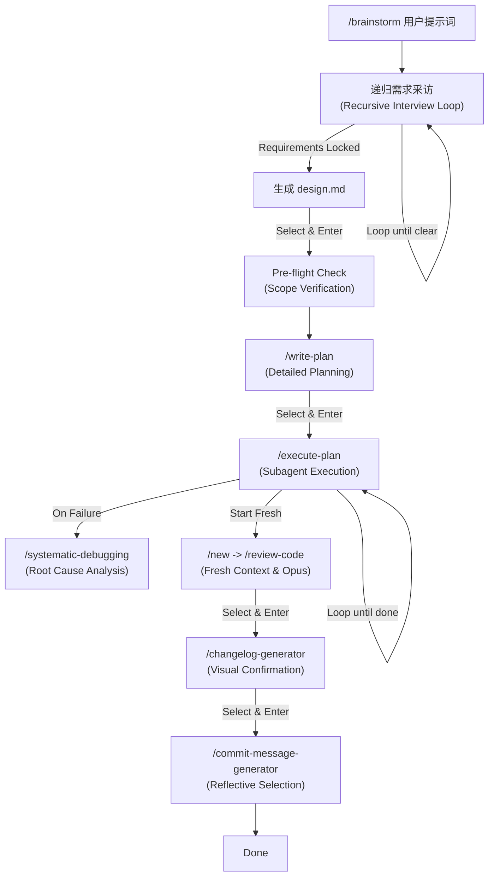

# 🛠 Learn Claude Code 学习套件 (Tool Suite)

**Learn Claude Code** 是一个标准化的 Claude Code 配置套件，旨在帮助开发者快速将最佳实践集成到自己的项目中。本版本基于 [Obra Superpowers](https://github.com/obra/superpowers)，经过精简重构，专注于 **Golang** 开发环境的优化。

## 核心特性

1.  **规则基石**：`.claude/constitution/constitution.md` 与 `.claude/rules/CORE_RULES.md` 共同定义了不可动摇的开发原则与工程规范。它们通过 `CLAUDE.md` -> `.claude/AGENTS.md` 链式加载，作为 **Non-Negotiable (不可协商)** 的上下文强制生效，确保 AI 始终遵循项目宪法。
2.  **认知架构**：深度集成**奥卡姆剃刀**（做减法）、**费曼技巧**（做加法）与**苏格拉底提问法**（做验证），构建自我调节的 AI 思维模型 (`.claude/constitution/prompt_engineering_annex.md`)。
3.  **角色化 Agent**：预设 Architect、Code Reviewer 等专家角色，配置位于 `.claude/agents/` 目录。
4.  **Golang 原生支持**：提供深度优化的 Go 语言开发规范 (`.claude/constitution/go_annex.md`) 与自动化格式化钩子 (`.claude/hooks/go/format-go-code.sh`)，集成 `gofmt`、`goimports`、`gofumpt` 等最佳实践工具链。
5.  **自动化闭环 (Automation Loop)**：内置 **Session Recovery** 与 **Skill Audit** 机制。
    *   `/audit-skills`：智能分析日志，自动发现工作流缺口并推荐新技能。
    *   `/recover`：一键恢复上下文（基于 `SessionEnd` Hook 自动生成的摘要），快速回到工作状态。
6.  **双重人格架构 (Dual Persona)**：独创的 **Builder (Opus)** vs **Critic (Codex)** 协作模式。Opus 负责从 0 到 1 的创造与文档，Codex 负责严格的代码审查与安全审计 (`.claude/agents/code-reviewer.md`)。
7.  **智能体技能库**：内置 Python 驱动的高级技能（如 `changelog-generator`、`skill-architect`），位于 `.claude/skills/` 目录，提供自动变更日志、技能进化等能力（仅依赖系统 Python，无需额外配置）。
8.  **动态上下文卫生**：内置 Token 优化协议 (`.claude/rules/CORE_RULES.md`)，指导 Agent 主动过滤大型输出，防止上下文爆炸。
9.  **递归需求分析 (Recursive Analysis)**：在 `/brainstorm` 阶段强制引入**多轮结构化采访**机制，通过递归追问（Recursive Interview）消除需求歧义，确保 Design 文档的绝对精准。
10. **自动化集成**：通过 `install.sh` 一键将配置注入到你的项目中，支持 macOS 原生 GUI 交互与智能文件合并（Smart Merge）。

---

## 🌊 FlowState: 零摩擦 AI 工作流 (Zero-Friction AI Workflow)

**FlowState** 是本套件的核心工作流引擎，通过智能引导将**提示词优化**、**方案规划**、**代码实现**、**代码审查**、**变更日志**与**提交信息**无缝串联，让开发过程像水一样自然流动。

### 🚀 快速上手 (Quick Start)

#### 1. 安装 (Installation)

**前置要求**：Claude Code CLI、Python 3.8+、Git。

推荐使用 `make` 命令安装：

```bash
make install
```

或者直接运行脚本：

```bash
# 标准安装（复制模式，推荐生产环境）
./scripts/installers/install.sh <你的目标 Go 项目路径>

# 开发安装（软链接模式，推荐开发调试）
./scripts/installers/install.sh --dev <你的目标 Go 项目路径>
```

#### 2. 体验工作流 (The Flow Experience)

安装完成后，在你的项目根目录下：

```bash
/brainstorm "实现一个 Python 斐波那契数列工具"
```

**后续的所有操作，您只需要使用方向键和 Enter 即可完成：**

```text
[FlowState] Design 阶段已完成。下一步做什么？ (Use arrow keys)
 » 🟢 继续执行 (Write Plan)
   ⚪️ 查看生成的文件 (Review Files)
   ⚪️ 修改需求 (Refine Spec)
   ⚪️ 退出 (Exit)
```

**真正的 "Hands-free" 体验，让您专注于决策而非命令。**

### 🎮 交互模式 (Interaction Model)

本插件采用 **Zero-Friction (零摩擦)** 交互设计：

1.  **全流程智能引导**: 系统主动提示下一步操作。
2.  **方向键导航**: 使用方向键选择，Enter 确认。
3.  **一键直达**: 确认后自动执行命令，无需手动输入。

### 📊 工作流全景 (Interactive Workflow)


```mermaid
graph TD
    Start["/brainstorm 用户提示词"] --> Interview["递归需求采访<br/>(Recursive Interview Loop)"]
    Interview -->|Loop until clear| Interview
    Interview -->|Requirements Locked| Optimize["生成 design.md"]
    Optimize -->|Select & Enter| PreFlight["Pre-flight Check<br/>(Scope Verification)"]
    PreFlight --> Plan["/write-plan<br/>(Detailed Planning)"]
    Plan -->|Select & Enter| Execute["/execute-plan<br/>(Subagent Execution)"]
    Execute -->|Loop until done| Execute
    Execute -->|On Failure| Debug["/systematic-debugging<br/>(Root Cause Analysis)"]
    Execute -->|Start Fresh| Review["/new -> /review-code<br/>(Fresh Context & Opus)"]
    Review -->|Select & Enter| Changelog["/changelog-generator<br/>(Visual Confirmation)"]
    Changelog -->|Select & Enter| Commit["/commit-message-generator<br/>(Reflective Selection)"]
    Commit --> Finish[Done]
```

**全程可视化进度**:
`[✔ Interview] → [✔ Design] → [✔ Plan] → [➤ Execute] → [Review] → [Changelog] → [Commit]`

## 🛠️ 核心命令详解

| 命令 | 描述 | 适用场景 |
| :--- | :--- | :--- |
| `/brainstorm` | **创意引擎**：启动任务，进行**多轮需求采访**与设计，生成 `design.md`。 | 新功能开发、复杂问题探索 |
| `/optimize-prompt` | **提示词优化师**：交互式优化你的 Prompt，确保最佳 AI 表现。 | 任务指令模糊、需要高质量输出时 |
| `/write-plan` | **架构师**：将设计文档转化为详细的实施步骤 (`todo.md`)。 | 确定方案后，开始编码前 |
| `/audit-skills` | **技能审计师**：分析历史日志，发现高频操作并推荐新 Skill。 | 定期优化工作流、觉得操作繁琐时 |
| `/recover` | **会话恢复专家**：智能分析 Git 状态与会话摘要，重建上下文。 | 每日开工、中断后恢复 |
| `/execute-plan` | **执行者**：自动执行计划中的任务，支持断点续传。 | 编码阶段，批量任务处理 |
| `/review-code` | **审查员**：对代码进行深度审查（增量 Diff 或全量）。 | 提交代码前，尤其是 Pull Request 前 |
| `/changelog-generator` | **日志专家**：自动分析 Git Diff，更新 `CHANGELOG.md`。 | 版本发布、功能合并后 |
| `/commit-message-generator` | **提交助手**：生成符合 Conventional Commits 规范的提交信息。 | 准备 git commit 时 |
| `/archive-task` | **归档员**：将当前任务的计划文件归档，保持工作区整洁。 | 任务完成后 |
| `/tidy-memory` | **记忆整理**：整理项目的核心记忆，优化上下文。 | 长期项目维护，定期执行 |

## 📂 目录结构说明

```text
.claude/
├── agents/         # Agent 角色定义 (Architect, Reviewer, etc.)
├── checklists/     # 检查清单 (Mental Model Checklist)
├── commands/       # 自定义命令脚本 (MCP/Slash Commands)
├── constitution/   # 项目宪法与核心原则 (Constitution)
├── docs/           # 详细文档与参考资料
├── hooks/          # Git Hooks (Pre-commit formatting)
├── lib/            # 共享库代码 (Python/Shell)
├── rules/          # 具体工程规则 (Core Rules)
├── scripts/        # 实用脚本 (Installers, Analyzers)
└── skills/         # 智能体技能库 (Python/Node 驱动的高级能力)
```

