# FlowState (Zero-Friction Workflow)

### 🌊 FlowState: Keep Your Flow Unbroken

**FlowState** 是一个 Claude Code 插件，致力于打造**零摩擦 (Zero-Friction)** 的 AI 开发工作流。它通过智能引导将**提示词优化**、**方案规划**、**代码实现**、**代码审查**、**变更日志**与**提交信息**无缝串联，让开发过程像水一样自然流动。

## 📦 安装 (Installation)

### 前置要求 (Prerequisites)
-   **Claude Code CLI**: 确保已安装并配置好 `claude` 命令行工具。
-   **Python 3.8+**: 用于运行部分辅助脚本。
-   **Git**: 用于版本控制和代码提交。

### 快速安装 (Quick Start)

1.  克隆或下载本项目。
2.  运行安装脚本：
    ```bash
    ./install.sh
    ```
    *(安装脚本会将插件内容安装到 `~/.claude/` 目录下)*

### 配置 (Configuration)

本项目依赖 `~/.claude/settings.json` 中的钩子配置来实现自动触发。请确保您的配置文件包含以下内容（或手动合并）：

```json
{
  "hooks": {
    "UserPromptSubmit": [
      {
        "hooks": [
          {
            "type": "command",
            "command": ".claude/hooks/claudeception-activator.sh"
          }
        ]
      }
    ]
  }
}
```

## 🚀 使用方法

只需执行首个命令，系统将在每个阶段完成后自动引导进入下一步。

### 📂 统一生成物管理 (Artifact Management)

您可以指定一个目录来统一管理任务流中的所有中间文件（如 `prompt.md`, `task_plan.md`, `review_report.md` 等），保持项目根目录整洁。

示例：
```bash
/optimize-prompt "实现斐波那契数列" fib
```
上述命令将：
1.  创建 `fib` 目录。
2.  将优化后的 Prompt 保存为 `fib/prompt.md`。
3.  后续的 `/plan`, `/execute`, `/review` 等步骤生成的中间文件都会自动存放在 `fib` 目录中。

**生成物目录结构示例 (Directory Structure)**:
```text
fib/
├── prompt.md           # 优化后的提示词
├── task_plan.md        # 任务规划与状态
├── findings.md         # 需求分析与发现
├── progress.md         # 执行进度日志
├── review_report.md    # 代码审查报告
├── CHANGELOG.md        # 变更日志
├── analysis_01.md      # (Silent Mode) 详细分析文档
└── run_tests.log       # (Silent Mode) 命令输出日志
```

> **💡 Tip**: 如果会话中断，您可以随时通过指定目录参数来恢复上下文：
> `/planning-with-files execute fib`

### 🤫 静默模式与文件优先 (Silent Mode & File-First)

为了保持会话窗口的简洁，Claude Code 将遵循 **"Silent Mode"** 原则：
-   **长文本自动归档**：任何超过 10 行的详细分析、调试日志或长篇推理，都会自动写入 `fib/analysis_*.md` 或 `fib/scratchpad.md`，并在会话中仅保留摘要和文件链接。
-   **命令输出重定向**：产生大量输出的命令（如测试日志）将被重定向到文件（如 `fib/test_run.log`）。
-   **"Don't print it if you can file it"**：让你的聊天界面始终保持清爽、专注于核心决策。

### 📊 交互式工作流 (Interactive Workflow)

```mermaid
graph TD
    Start["/optimize-prompt 用户提示词"] --> Optimize["交互式问答, 生成 prompt.md"]
    Optimize -->|Tab| Plan["/planning-with-files plan<br/>(Step 2 Interview)"]
    Plan -->|Tab| Execute["/planning-with-files execute<br/>(Atomic Execution)"]
    Execute -->|Loop until done| Execute
    Execute -->|Tab| Review["/review-code<br/>(Reflective Handoff)"]
    Review -->|Tab| Changelog["/changelog-generator<br/>(Visual Confirmation)"]
    Changelog -->|Tab| Commit["/commit-message-generator<br/>(Reflective Selection)"]
    Commit --> Finish[Done]

    style Start fill:#f9f,stroke:#333,stroke-width:2px
    style Optimize fill:#e1f5fe,stroke:#01579b
    style Plan fill:#e1f5fe,stroke:#01579b
    style Execute fill:#fff9c4,stroke:#fbc02d
    style Review fill:#e0f2f1,stroke:#00695c
    style Changelog fill:#f3e5f5,stroke:#7b1fa2
    style Commit fill:#fce4ec,stroke:#c2185b
    style Finish fill:#f9f,stroke:#333,stroke-width:2px
```



**Visual Progress Bar (全程可视化进度)**:
`[✔ Step 1: Optimize] → [✔ Step 2: Plan] → [➤ Step 3: Execute] → [Step 4: Review] → [Changelog] → [Commit]`

### 🛠️ 核心命令详解

1.  **`/optimize-prompt`** (Step 1): 
    -   **Socratic Analysis**: 采用苏格拉底提问法，深度挖掘需求。
    -   **Output**: 生成优化后的 Prompt。
2.  **`/planning-with-files plan`** (Step 2): 
    -   **Phase 0 Interview**: 规划前强制进行架构与技术栈确认。
    -   **Output**: 生成 `task_plan.md`。
3.  **`/planning-with-files execute`** (Step 3): 
    -   **Strict Atomic Execution**: 每次**严格**只执行一个任务阶段 (Task Phase)，绝不自动进入下一阶段。
    -   **Mandatory TUI Handoff**: 每阶段完成后必须暂停，显示 TUI 菜单等待用户明确指令（继续/暂停/提交）。
4.  **`/review-code`**: 
    -   **Reflective Handoff**: 提供基于审查结果的情境选项 (生成日志/修复问题/人工复核)。
5.  **`/changelog-generator`**: 
    -   **Visual Confirmation**: TUI 状态条确认变更日志更新。
6.  **`/commit-message-generator`**: 
    -   **Reflective Selection**: 提供 TUI 菜单对比不同风格的 Commit Message。

## 💧 设计哲学：像水一样流动 (Zero-Friction Flow)

我们的核心目标是**尽量减少用户操作和输入**，打造极致的**丝滑**体验。整个工作流设计如同**多米诺骨牌**，一触即发，环环相扣。

-   **零摩擦 (Zero Friction)**: 系统会自动预判你的下一步需求，并自动填充命令。
-   **Rich Interaction & Socratic Flow (丰富的交互与苏格拉底引导)**:
    -   **Visual Progress**: 全程可视化进度条，让你时刻掌握当前所处阶段。
    -   **Socratic Method**: 在关键决策点（如规划前、提交前）主动进行苏格拉底式提问，确保你考虑周全，而不是盲目执行。
-   **Tab 键驱动 (Tab-to-Execute)**: 你不需要手动输入复杂的指令，只需按下 `Tab` 键确认，流程就会自动向下流动。
-   **把控权 (Control in Flow)**:
    -   **Mandatory Review**: 在规划完成后，强制暂停供你审查方案。
    -   **Atomic Execution**: 每个开发阶段（Phase）原子化执行，绝不“抢跑”。
    -   **Interactive Handoff**: 在阶段完成时提供明确选项（继续/审查/提交），由你决定流向。
-   **可移植性 (Portability)**: 所有脚本路径均动态计算，不依赖硬编码的绝对路径，确保在不同机器和环境（macOS/Linux/Windows WSL）下均可正常运行。

工作流应该像水一样流畅，让你的思维不再被繁琐的命令打断。

**技能自我进化 (Skill Architect)**:
当你在使用任何工具时，系统会自动评估你的操作。如果你修复了一个 Bug、发现了一个更好的 Prompt 或创建了一个新工具，`Skill Architect` 会引导你将其沉淀下来。
- **Forge**: 将新能力封装为标准 Skill。
- **Refine**: 将经验（Fixes/Preferences）注入现有 Skill。
- **Stitch**: 自动更新 Skill 文档，让工具越用越聪明。

## ❓ 常见问题 (Troubleshooting)

-   **Q: 为什么流程没有自动弹出下一步提示？**
    A: FlowState 依赖 Claude Code 的 `RunCommand` 提议机制。如果因为某些原因没有自动弹出，您可以手动输入 `/planning-with-files execute` 或直接按 `Tab` 键尝试。
-   **Q: TUI 菜单显示异常？**
    A: 请确保您的终端支持 UTF-8 编码和 ANSI 转义序列（推荐使用 iTerm2, VS Code Terminal, 或 Windows Terminal）。
-   **Q: 如何手动触发特定阶段？**
    A: 您可以直接运行对应的子命令，例如 `/review-code` 或 `/changelog-generator`，无需严格按照流程顺序。

## 📄 许可证 (License)

本项目基于 [MIT License](https://opensource.org/licenses/MIT) 开源。

---
*Built with ❤️ for the Claude Code Community.*
