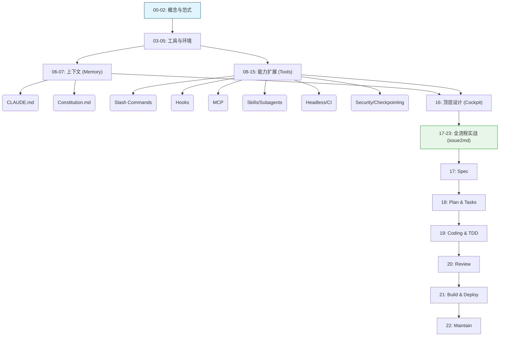

# 🚀 AI 原生开发工作流实战 - 课程大纲与学习指南

> link: https://time.geekbang.org/column/intro/101089301?utm_campaign=geektime_search&utm_content=geektime_search&utm_medium=geektime_search&utm_source=geektime_search&utm_term=geektime_search

欢迎来到《AI 原生开发工作流实战》课程资料库. 本课程旨在帮助软件工程师从传统的 "人机协作" 模式, 进化为驾驭 AI Agent 的 "AI 原生" 开发者. 通过 24 讲的系统学习, 你将掌握以 **Claude Code** 为核心的下一代软件工程范式. 

---

## 📚 1. 文档概览

### 📊 统计与分类
*   **文档总数**: 24 篇 (00 - 23)
*   **核心主题**: AI Native Paradigm, Spec-Driven Development (SDD), Agentic Workflow, DevOps Automation.

本课程体系由浅入深, 分为四个核心模块: 

| 模块 | 章节范围 | 核心目标 | 难度 | 建议时长 |
| :--- | :--- | :--- | :--- | :--- |
| **Concept (概念篇)** | 00 - 02 | 建立 AI 原生世界观, 掌握 SDD 核心方法论 | ⭐ | 1.5 小时 |
| **Basic (基础篇)** | 03 - 05 | 搭建环境, 掌握 `@` (上下文) 与 `!` (行动) 核心交互 | ⭐⭐ | 2 小时 |
| **Advanced (进阶篇)** | 06 - 15 | 深度定制 AI, 掌握 Context 管理、安全、Hook 与扩展 | ⭐⭐⭐ | 6 小时 |
| **Practical (实战篇)** | 16 - 23 | 真实项目 `issue2md` 全生命周期演练 (设计->开发->交付->维护) | ⭐⭐⭐⭐ | 10 小时 |

### 🧠 知识体系逻辑关系
整个课程遵循 **"道 (Dao) -> 术 (Shu) -> 器 (Qi) -> 用 (Yong)"** 的逻辑演进: 
*   **道**: 00-02 (范式转移, 规范驱动)
*   **术**: 06-11 (上下文管理, 安全机制, 自动化编排)
*   **器**: 03-05, 12-15 (Claude Code, MCP, Headless)
*   **用**: 16-23 (全流程实战)

---

## 📝 2. 重点内容提炼

### 🌟 模块一: 概念与认知 (00-02)

#### [00 开篇词](00_introduction.md)
*   **三大摩擦力**: 上下文摩擦、工作流摩擦、认知摩擦. 
*   **核心理念**: 从 "AI 助理" (Assistant) 进化为 "AI 同事" (Colleague). 
*   **新角色**: 规范设计者、工作流指挥家、质量治理者. 

#### [01 范式演进](01_paradigm_evolution.md)
*   **集成成熟度模型**: Level 1 (Chatbot) -> Level 2 (Copilot) -> Level 3 (Agent) -> Level 4 (Autonomous). 
*   **核心转变**: 从 Human-in-the-loop 到 Human-on-the-loop (监督者). 

#### [02 核心引擎: 规范驱动开发 (SDD)](02_core_engine_spec_driven.md)
*   **权力反转**: Spec (规范) 取代 Code 成为 Source of Truth. 
*   **编译隐喻**: AI 是将 Intent (意图) 编译为 Code 的编译器. 
*   **核心产物**: `spec.md` (需求) -> `plan.md` (方案) -> `tasks.md` (任务) -> Code. 

### 🛠️ 模块二: 基础与环境 (03-05)

#### [03 Agent 生态](03_agent_ecosystem_claude_code.md)
*   **为何选择 CLI Agent**: 执行深度更深, 集成自由度更高. 
*   **工具对比**: Aider (先驱), Cline/Roo (IDE集成), Claude Code (原生/Agentic). 

#### [04 环境搭建](04_environment_setup.md)
*   **车身与引擎分离**: Client (Claude Code) + Model (Zhipu/Claude). 
*   **分层配置**: Managed > CLI > Local > Project > User (`settings.json`). 
*   **实战**: 配置 `ANTHROPIC_BASE_URL` 接入智谱 AI. 

#### [05 核心交互模型](05_interaction_model.md)
*   **`@` (Context)**: 注入文件、文件夹、Git 提交、Web 链接. 
*   **`!` (Action)**: 执行 Shell 命令, 获取执行结果. 
*   **REPL 循环**: Read-Eval-Print Loop 的 AI 增强版. 

### 🧩 模块三: 进阶能力 (06-16)

#### 上下文与规范 (06-07)
*   **[06 CLAUDE.md](06_context_art_part1.md) : 详解%20CLAUDE.md%20与%20AGENTS.md-AI%20原生开发工作流实战%20-%20极客时间.md)**: 项目的 "长期记忆" (Long-term Memory). 
*   **[07 Constitution](07_context_art_part2.md) : 用%20constitution.md%20为%20AI%20注入项目%20"宪法"-AI%20原生开发工作流实战%20-%20极客时间.md)**: 项目的 "宪法" (不可协商的原则, 如 TDD、No ORM). 

#### 能力扩展 (08, 11-14)
*   **[08 Slash Commands](08_custom_commands.md)**: 封装高频工作流 (e.g., `/review`, `/commit`). 
*   **[11 Hooks](11_event_driven_hooks.md)**: 事件驱动自动化 (e.g., `PostToolUse` 自动格式化代码). 
*   **[12 MCP](12_mcp_servers.md)**: 连接外部世界 (GitHub, Jira, Database). 
*   **[13 Skills](13_agent_skills.md)**: 声明式能力, AI 自主发现与调用. 
*   **[14 Subagents](14_subagents.md)**: 独立上下文的专家分身, 解决复杂任务. 

#### 安全与自动化 (09-10, 15)
*   **[09 权限与沙箱](09_security_basics_part1.md) : 用权限控制与沙箱为%20AI%20戴上%20"安全镣铐"-AI%20原生开发工作流实战%20-%20极客时间.md)**: Permissions (Ask/Allow/Deny) + Sandbox (Docker/Bwrap). 
*   **[10 Checkpointing](10_security_basics_part2.md) !%20Checkpointing, 获得让%20AI%20"时光倒流"%20的超能力%20-%20AI%20原生开发工作流实战%20-%20极客时间.md)**: `/rewind` 时光倒流, 安全的试错机制. 
*   **[15 Headless](15_headless_mode.md)**: 非交互模式, 集成 CI/CD 流水线. 

### 🏗️ 模块四: 实战演练 (16-23)

*   **[16 顶层设计](16_top_level_design.md)**: 构建标准化的项目脚手架 (`.claude/` 目录结构). 
*   **[17 需求与设计](17_requirements_and_design.md)**: 从模糊意图 -> `spec.md`. 
*   **[18 计划与任务](18_planning_and_tasks.md)**: Spec -> `plan.md` (技术方案) -> `tasks.md` (原子任务). 
*   **[19 编码与测试](19_coding_and_testing.md)**: TDD 循环 (Red -> Green -> Refactor). 
*   **[20 协同与审查](20_collaboration_and_review.md)**: AI 交叉审查, 自动生成 PR 描述. 
*   **[21 构建与交付](21_build_and_delivery.md)**: AI 生成 Dockerfile, Makefile, GitHub Actions. 
*   **[22 维护与重构](22_maintenance_and_refactoring.md)**: 遗留系统分析, 安全重构. 

---

## 📅 3. 学习方案设计

### 📈 渐进式学习路径

1.  **Day 1-2: 环境准备与 Hello World**
    *   安装 Node.js, Claude Code. 
    *   配置 Zhipu AI 或其他兼容 API. 
    *   练习 `@` 读取文件和 `!` 执行简单命令. 
    *   **练习**: 让 AI 解释一段你看不懂的代码. 

2.  **Day 3-5: 定制你的 AI 伙伴**
    *   创建 `CLAUDE.md`, 定义项目基础信息. 
    *   创建 `constitution.md`, 定义一条"铁律" (如: 必须写注释). 
    *   编写第一个 Slash Command `/hello`. 
    *   **练习**: 为你的个人项目配置一套 Context 文件. 

3.  **Day 6-7: 解锁高级能力**
    *   尝试使用 Checkpointing (`/rewind`) 进行一次大胆的代码修改并回滚. 
    *   配置一个简单的 MCP (如 Filesystem 或 Git). 
    *   **练习**: 编写一个 Headless 脚本, 自动总结 Git Diff. 

4.  **Day 8-14: 全流程实战 (Project: issue2md)**
    *   跟随 17-22 讲, 从零开发 `issue2md` 工具. 
    *   **关键点**: 必须亲手体验从 `spec.md` 到 `tasks.md` 的生成过程, 不要跳过 TDD 环节. 

### ✅ 验证学习效果的方法
*   **能够脱离 Web UI**: 90% 的开发工作在终端内通过 Claude Code 完成. 
*   **拥有自己的 "驾驶舱"**: 拥有一套属于自己的 `.claude/` 配置模板库. 
*   **思维转变**: 遇到问题第一反应不是 "怎么写代码", 而是 "如何清晰地描述需求". 

---

## 📖 4. 使用指南

### 🎯 典型应用场景

#### 场景一: 新功能开发 (SDD 流程)
1.  **Intent**: 告诉 AI "我想做一个...". 
2.  **Spec**: AI 生成 `spec.md`, 你进行确认. 
3.  **Plan**: AI 生成 `plan.md` (技术方案). 
4.  **Tasks**: AI 生成 `tasks.md` (任务列表). 
5.  **Code**: AI 逐个执行 Task, 遵循 TDD. 

#### 场景二: 遗留代码维护 (Headless 模式)
1.  **诊断**: `cat error.log | claude -p "分析根因" @src/`
2.  **理解**: `claude -p "解释这个函数的作用" @legacy_file.go`
3.  **重构**: 使用 Checkpointing 机制, 让 AI 尝试重构, 不满意直接 `/rewind`. 

### 🔍 快速索引
*   **想知道如何配置 API Key?** -> [04 环境搭建](04_environment_setup.md)
*   **想知道如何写 `CLAUDE.md`?** -> [06 上下文艺术](06_context_art_part1.md) : 详解%20CLAUDE.md%20与%20AGENTS.md-AI%20原生开发工作流实战%20-%20极客时间.md)
*   **想知道如何回滚错误操作?** -> [10 Checkpointing](10_security_basics_part2.md) !%20Checkpointing, 获得让%20AI%20"时光倒流"%20的超能力%20-%20AI%20原生开发工作流实战%20-%20极客时间.md)
*   **想知道如何集成 CI/CD?** -> [15 Headless](15_headless_mode.md)

---

## 🗺️ 附录: 文档关联关系图

