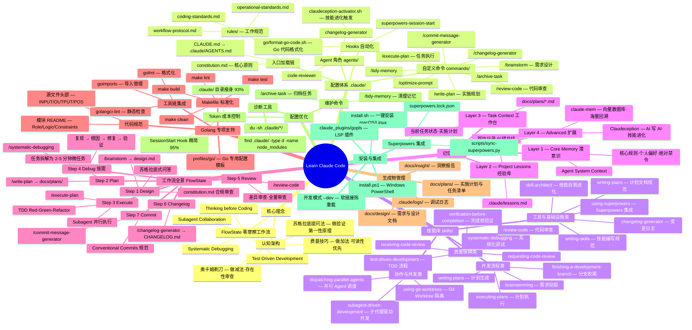

# Learn Claude Code — 项目思维导图

```mermaid
mindmap
  root((Learn Claude Code))
    核心理念
      认知架构
        奥卡姆剃刀 — 做减法·存在性审查
        费曼技巧 — 做加法·可读性优先
        苏格拉底提问法 — 做验证·第一性原理
      FlowState 零摩擦工作流
        Thinking before Coding
        Test Driven Development
        Systematic Debugging
        Subagent Collaboration

    配置体系 .claude/
      入口加载链
        CLAUDE.md → .claude/AGENTS.md
        constitution.md — 核心原则
        rules/ — 工作规范
          coding-standards.md
          operational-standards.md
          workflow-protocol.md
      自定义命令 commands/
        /brainstorm — 需求设计
        /write-plan — 实施规划
        /execute-plan — 任务执行
        /review-code — 代码审查
        /changelog-generator
        /commit-message-generator
        /optimize-prompt
        /archive-task
        /tidy-memory
      Agent 角色 agents/
        changelog-generator
        code-reviewer
      Hooks 自动化
        claudeception-activator.sh — 技能进化触发
        go/format-go-code.sh — Go 代码格式化
        superpowers-session-start

    技能库 skills/
      开发流程类
        brainstorming — 需求挖掘
        writing-plans — 计划生成
        executing-plans — 计划执行
        finishing-a-development-branch — 分支收尾
      质量保障类
        test-driven-development — TDD 流程
        systematic-debugging — 系统化调试
        verification-before-completion — 完成前验证
        review-code — 代码审查
        requesting-code-review
        receiving-code-review
      协作与并发类
        dispatching-parallel-agents — 并行 Agent 调度
        subagent-driven-development — 子代理驱动开发
        using-git-worktrees — Git Worktree 隔离
      工具与基础设施类
        skill-architect — 技能自我进化
        writing-skills — 技能编写规范
        writing-plans — 计划文档规范
        changelog-generator — 变更日志
        using-superpowers — Superpowers 集成

    记忆架构
      Layer 1 — Core Memory 潜意识
        Agent System Context
        核心规则·个人偏好·绝对禁令
      Layer 2 — Project Lessons 经验库
        .claude/lessons.md
        踩坑记录·纠错总结
      Layer 3 — Task Context 工作台
        docs/plans/*.md
        当前任务状态·实施计划
      Layer 4 — Advanced 扩展
        Claudeception — AI 写 AI·技能进化
        claude-mem — 向量数据库·海量回溯

    工作流全景 FlowState
      Step 1 Design
        /brainstorm → design.md
        苏格拉底式问答
        constitution.md 合规审查
      Step 2 Plan
        /write-plan → docs/plans/
        任务拆解为 2-5 分钟微任务
      Step 3 Execute
        /execute-plan
        Subagent 并行执行
        TDD Red-Green-Refactor
      Step 4 Debug 按需
        /systematic-debugging
        复现 → 根因 → 修复 → 验证
      Step 5 Review
        /review-code
        差异审查·全量审查
      Step 6 Changelog
        /changelog-generator → CHANGELOG.md
      Step 7 Commit
        /commit-message-generator
        Conventional Commits 规范

    Golang 专项支持
      profiles/go/ — Go 专用配置模板
      工具链集成
        gofmt — 格式化
        goimports — 导入管理
        golangci-lint — 静态检查
      Makefile 标准化
        make build
        make test
        make lint
        make clean
      代码规范
        模块 README — Role/Logic/Constraints
        源文件头部 — INPUT/OUTPUT/POS

    生成物管理
      docs/design/ — 需求与设计文档
      docs/plans/ — 实施计划与任务清单
      docs/insight/ — 洞察报告
      .claude/logs/ — 调试日志

    配置优化
      Token 成本控制
        SessionStart Hook 精简 95%
        .claude/ 目录瘦身 93%
      诊断工具
        find .claude/ -type d -name node_modules
        du -sh .claude/*/
      维护命令
        /tidy-memory — 清理记忆
        /archive-task — 归档任务

    安装与集成
      install.sh — 一键安装 macOS/Linux
      install.ps1 — Windows PowerShell
      开发模式 --dev — 软链接热重载
      Superpowers 集成
        superpowers.lock.json
        scripts/sync-superpowers.py
      claude_plugins/gopls — LSP 插件
```
