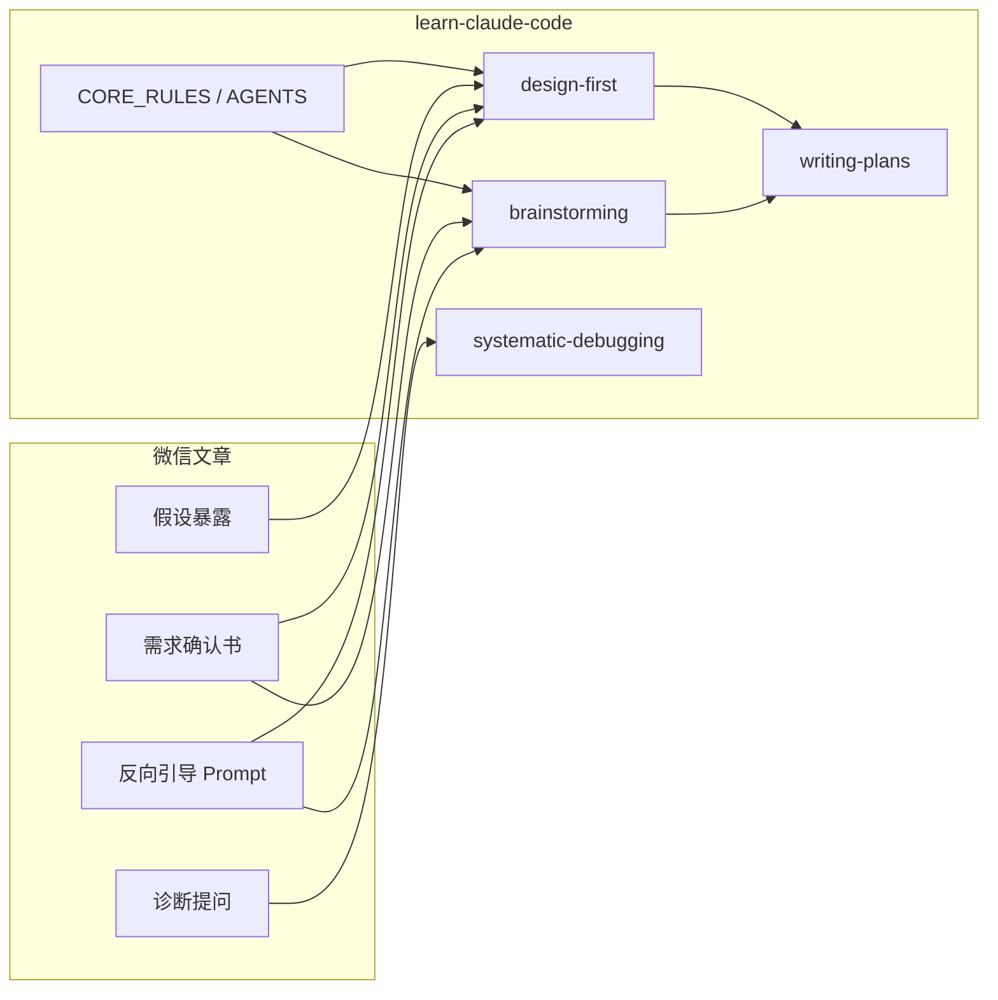

# 微信文章《让 Claude Code 自己提问》— 分析与落地对照

**来源**：[让 Claude Code 自己提问：反向引导的高级技巧](https://mp.weixin.qq.com/s/jDuIako0hnVlEVzlcZ4iJg)（作者 Sam）  
**日期**：2026-05-25  
**关联落地**：`docs/guides/reverse-prompting.md`、`docs/plans/_templates/requirements-ack.md`、`.claude/skills/design-first`、`brainstorming`、`systematic-debugging`

---

## 1. 文章核心主张

| 主题 | 内容 |
|------|------|
| 问题 | 你描述需求时会**默认填补**边界、失败态、非目标；模型没有这些默认，推断方向常不一致 |
| 解法 | **反向引导**：让模型先提问，你回答后再实现 |
| 入口句 | `在开始之前，先问我你需要知道的问题` |
| 关键约束 | 必须加 **「列完问题后停下来，等我回答，不要自己假设答案」**，否则模型会自问自答后直接写代码 |

文章声称：中等复杂功能从「3–5 轮改 Prompt」可收敛到「一轮问答对齐」。该数字为作者经验值，本仓库以**可检查产物**（需求确认书 + 设计门控）为准，不复制未验证的指标。

---

## 2. 三种用法（与仓库映射）

### 2.1 需求启动 · 问题清单

**文章**：一句话需求 → 列出实现前必须澄清的问题 → 用户逐条回答 → 再动手。

**本仓库现状**：

- `brainstorming` / `design-first` 已覆盖「先澄清再实现」
- `AGENTS.md` 对新功能强制 Grill-Me
- `CORE_RULES`：不确定就问，不要猜

**差距**：缺少**固定文件名**的「需求确认书」；`brainstorming` 未明文禁止「替用户填假设答案」。

**落地**：见 `requirements-ack` 模板；`brainstorming_full.md` HARD-GATE 增补。

### 2.2 复杂 Bug · 诊断式提问

**文章**：不要只扔 stack trace；让模型先问复现性、前后改动、日志位置等；回答过程中用户常自行定位。

**本仓库现状**：`docs/skills/README.md` 索引了 `systematic-debugging`，但仓库内**无**对应 SKILL 文件（可能仅在 superpowers 插件）。

**落地**：新增 `.claude/skills/systematic-debugging/SKILL.md`，首步为诊断提问清单。

### 2.3 方案设计前 · 假设暴露

**文章**：出方案前列出模型对「用户行为 / 技术环境 / 边界」的**隐性假设**，用户纠正后再设计（出海场景：货币、时区、日期格式等）。

**本仓库现状**：`design-first` 有 Constitution Check、追问上限，**无**独立的「假设列表 → 用户确认」步骤。

**落地**：`design-first` 阶段 2 与 3 之间增加 **阶段 2b：假设暴露**（M/H 级）。

---

## 3. 提问质量「旋钮」

文章建议的三类调节，适合**用户侧**短 Prompt，不必每次走完整 Grill-Me：

| 旋钮 | 示例 Prompt 片段 |
|------|------------------|
| 限定类型 | 只问和技术实现直接相关的问题，业务背景见 CLAUDE.md |
| 数量上限 | 最多问 5 个最关键的问题 |
| 优先级 | 按对方案影响排序；时间紧我只回答前 3 个 |

**本仓库**：`design-first` 已有 L/M/H 题量上限；**缺口**是面向用户的可复制句式 → 写入 `docs/guides/reverse-prompting.md`。

---

## 4. 需求确认书（完整版流程）

文章流程：**问题清单 → 用户回答 → 需求确认书 → 用户确认 → 实现**。

确认书应包含：

1. 功能描述（**模型理解版**，非用户原话复述）
2. 边界条件列表
3. **已确认**的假设（与用户校对过）
4. **明确不在范围内**的内容

**会话续接**：新会话粘贴确认书即可恢复上下文；与本仓库 BDD `.local.md` **互补**（确认书 = 需求契约，state 文件 = 执行进度）。

**落地路径**：`docs/plans/YYYY-MM-DD-<topic>-requirements-ack.md`（模板见 `_templates/requirements-ack.md`）。

---

## 5. 常见踩坑

| 坑 | 现象 | 本仓库对策 |
|----|------|------------|
| 自问自答 | 列问题后自行假设并出方案/写代码 | `brainstorming` / `design-first` 写明 STOP |
| 问题过泛 | 十几个可推断的废话问题 | `design-first` Anti-Anchoring + 题量上限；用户侧用「最多 5 问」 |
| 与 Skill 蒸馏文混淆 | 另一篇讲 S=(C,π,T,R) | 本篇改**会话习惯**；蒸馏文改 **SKILL.md 结构**（见 `docs/research/2026-04-28-wechat-skill-optimization-checklist.md`） |

---

## 6. 与本项目已有能力的关系

**结论**：理念 largely **已覆盖**；落地重点是 **产物模板 + 明文 STOP + debug skill + 用户指南**，而非新造一套流程。

---

## 7. 落地清单（已完成项）

| # | 动作 | 路径 |
|---|------|------|
| 1 | 分析文档（本文） | `docs/research/2026-05-25-wechat-reverse-prompting.md` |
| 2 | 用户可复制 Prompt 与旋钮 | `docs/guides/reverse-prompting.md` |
| 3 | 需求确认书模板 | `docs/plans/_templates/requirements-ack.md` |
| 4 | 禁止自问自答 + 确认书写入 | `.claude/docs/references/skills/brainstorming_full.md` |
| 5 | 假设暴露 + 确认书门控 | `.claude/skills/design-first/SKILL.md` |
| 6 | 诊断式提问首步 | `.claude/skills/systematic-debugging/SKILL.md` |
| 7 | 分享稿补充 | `docs/talks/2026-05-25-claude-code-sharing.md` |
| 8 | 技能索引更新 | `docs/skills/README.md` |

---

## 8. 后续可选（未纳入本次）

- `writing-plans` 强制引用同主题的 `requirements-ack.md`
- `make lint-skills` 校验新 skill frontmatter
- 将「反向引导」写入 `install.sh` 安装后的 Quick Start 一页纸

---

## 9. 参考

- 微信原文：https://mp.weixin.qq.com/s/jDuIako0hnVlEVzlcZ4iJg
- Skill 蒸馏对照：`docs/research/2026-04-28-wechat-skill-optimization-checklist.md`
- brainstorming Round 3 评估：`docs/reports/2026-04-28-darwin-skill-eval-brainstorming-round3.md`
